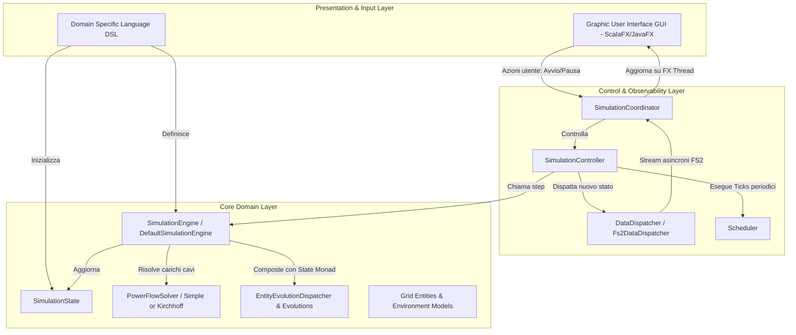
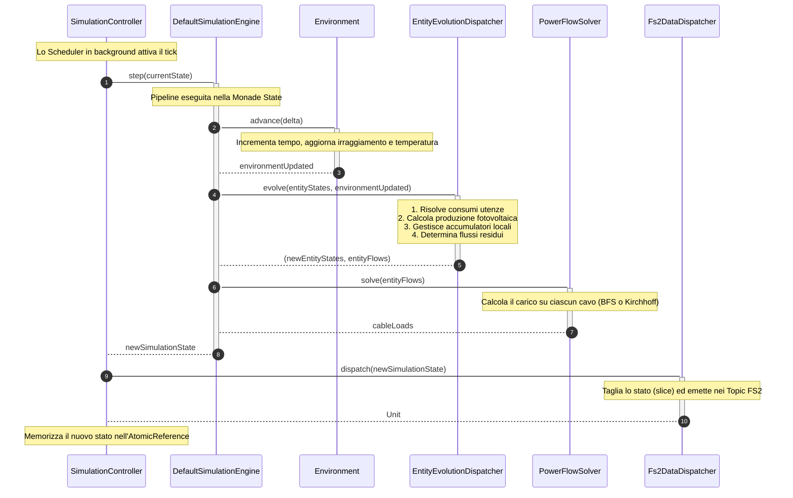

# Design Architetturale

Questo capitolo descrive formalmente il design architetturale del simulatore di micro-grid **GridSim**. L'analisi si concentra sulla giustificazione delle scelte strutturali e tecnologiche a livello macroscopico, evidenziando come i diversi pattern garantiscano la manutenibilità, l'estensibilità, il determinismo e la testabilità del sistema. I dettagli implementativi dei singoli moduli e delle classi saranno discussi nella sezione dedicata al design di dettaglio.

---

## 1. Pattern Architetturali di Riferimento

L'architettura complessiva di GridSim non si limita a un singolo modello, ma sintetizza sinergicamente tre pattern complementari: **Functional Core, Imperative Shell (FCIS)**, **Ports and Adapters (Hexagonal Architecture)** e **Model-View-ViewModel (MVVM)**.

```
       +--------------------------------------------------------------+
       |                       IMPERATIVE SHELL                       |
       |                                                              |
       |  +--------------------------------------------------------+  |
       |  |                   PORTS & ADAPTERS                     |  |
       |  |                                                        |  |
       |  |  +--------------------------------------------------+  |  |
       |  |  |                 FUNCTIONAL CORE                  |  |  |
       |  |  |                                                  |  |  |
       |  |  |  - Pure Domain Logic (Models & Behaviours)       |  |  |
       |  |  |  - Immutable Simulation State                    |  |  |
       |  |  |  - Pure State Transitions (State Monad)          |  |  |
       |  |  +--------------------------------------------------+  |  |
       |  |                           |                            |  |
       |  |      [Ports / Interfaces] | [Adapters / ViewModels]    |  |
       |  +---------------------------|----------------------------+  |
       |                              |                               |
       |   - GUI (Views / ScalaFX)    |  - DSL Config Loader          |
       |   - Concurrency / FS2 Streams|  - JavaFX UI Thread Loop      |
       +--------------------------------------------------------------+
```

### 1.1 Functional Core, Imperative Shell (FCIS)
Il motore fisico e matematico della simulazione è progettato seguendo il paradigma della programmazione funzionale pura, isolando la logica di business in un **Functional Core** privo di effetti collaterali. L'interazione con l'esterno, la gestione dell'asincronia e l'aggiornamento dell'interfaccia utente sono confinati nell'**Imperative Shell**.

- **Core Immutabile**: Lo stato della simulazione ad ogni istante temporale è incapsulato nella classe [SimulationState](file:///home/michelenardini/GridSim/app/src/main/scala/org/gridsim/core/simulation/SimulationState.scala), modellata come struttura dati immutabile.
- **Transizioni Pure**: L'avanzamento temporale è definito dall'interfaccia [SimulationEngine](file:///home/michelenardini/GridSim/app/src/main/scala/org/gridsim/core/simulation/SimulationEngine.scala) tramite una funzione matematica pura:
  $$\text{step} : \text{SimulationState} \to \text{SimulationState}$$
  Questa funzione riceve uno stato, applica le equazioni fisiche e i bilanci energetici locali e globali, e restituisce un nuovo stato immutabile, senza alcuna mutazione in-place o interazione con canali di I/O.
- **Giustificazione del Pattern**:
  1. **Determinismo Assoluto**: A parità di stato iniziale e input ambientali, l'esecuzione del core produce sempre la medesima sequenza di stati. Ciò elimina i bug legati alla concorrenza non deterministica o a stati transitori inconsistenti.
  2. **Elevata Testabilità**: La logica fisica e algoritmica può essere testata tramite test unitari tradizionali, senza richiedere mocking di componenti grafici, database o scheduler temporizzati.
  3. **Analisi Storica (Time Travel)**: L'immutabilità dello stato consente di memorizzare la cronologia dei tick como una semplice lista di riferimenti a [SimulationState](file:///home/michelenardini/GridSim/app/src/main/scala/org/gridsim/core/simulation/SimulationState.scala). Non essendoci copie profonde (deep copy) da effettuare ad ogni tick, la memorizzazione dello storico ha un impatto computazionale e di memoria trascurabile.

### 1.2 Ports and Adapters (Architettura Esagonale)
Per evitare che il dominio puro della simulazione sia accoppiato a framework specifici (como JavaFX/ScalaFX per l'interfaccia utente, o librerie esterne di serializzazione), GridSim adotta l'architettura **Ports and Adapters**.

- **Confine del Core**: Il core definisce interfacce astratte (Ports) per descrivere le proprie necessità di calcolo ed estrazione dati. Ad esempio, il calcolo dei flussi elettrici sui cavi è esposto tramite la porta [PowerFlowSolver](file:///home/michelenardini/GridSim/app/src/main/scala/org/gridsim/core/solver/PowerFlowSolver.scala).
- **Adattatori Esterni**: Moduli esterni implementano queste interfacce (Adapters). Il modulo `solver` offre adattatori concreti quali [SimplePowerFlowSolver](file:///home/michelenardini/GridSim/app/src/main/scala/org/gridsim/core/solver/SimplePowerFlowSolver.scala) (risoluzione di reti radiali) o [KirchhoffPowerFlowSolver](file:///home/michelenardini/GridSim/app/src/main/scala/org/gridsim/core/solver/KirchhoffPowerFlowSolver.scala) (risoluzione di reti magliate generiche).
- **Giustificazione del Pattern**: Consente di sostituire l'algoritmo di risoluzione elettrica o l'infrastruttura di visualizzazione (passando, ad esempio, da una GUI desktop JavaFX a una console CLI o a un servizio web) senza dover modificare o ricompilare le regole di business fondamentali relative a generatori, batterie o utenze.

### 1.3 Model-View-ViewModel (MVVM)
Nel livello di presentazione graficamente interattiva, GridSim adotta il pattern **MVVM** per disaccoppiare la struttura visiva dell'applicazione dalla sua logica di controllo.

- **Model**: Rappresentato dai dati emessi dal ciclo di simulazione (lo stato corrente [SimulationState](file:///home/michelenardini/GridSim/app/src/main/scala/org/gridsim/core/simulation/SimulationState.scala)).
- **ViewModel**: I componenti della cartella [viewmodel](file:///home/michelenardini/GridSim/app/src/main/scala/org/gridsim/gui/viewmodel) (es. [SimulationControlViewModel](file:///home/michelenardini/GridSim/app/src/main/scala/org/gridsim/gui/viewmodel/SimulationControlViewModel.scala)) espongono lo stato del modello sotto forma di proprietà osservabili reattive (`Property` di ScalaFX) e definiscono i comandi che la View può invocare in risposta alle interazioni dell'utente.
- **View**: I componenti della cartella [view](file:///home/michelenardini/GridSim/app/src/main/scala/org/gridsim/gui/view) (es. [SimulationControlView](file:///home/michelenardini/GridSim/app/src/main/scala/org/gridsim/gui/view/SimulationControlView.scala)) definiscono il layout grafico, collegando in maniera dichiarativa (binding bidirezionale o unidirezionale) i widget grafici alle proprietà esposte dal rispettivo ViewModel.
- **Giustificazione del Pattern**: Impedisce la presenza di logica di business all'interno delle classi grafiche. Ciò consente di testare il comportamento dell'interfaccia utente (abilitazione/disabilitazione di bottoni, formattazione di testi, logiche di transizione di stato della GUI) istanziando e testando unicamente i ViewModel, bypassando la necessità di avviare il motore grafico JavaFX nei test di integrazione.

---

## 2. Separazione delle Responsabilità e Struttura Modulare

La struttura del codice è rigorosamente suddivisa in moduli con relazioni di dipendenza unidirezionali e centripete: i moduli più esterni dipendono da quelli interni, mentre il nucleo centrale non ha alcuna conoscenza dei dettagli esterni.



### 2.1 Core Domain Layer
È il nucleo centrale dell'applicazione ed è completamente disaccoppiato da concetti di threading, interfacce grafiche o parser di file.
- **`model`**: Definisce la rappresentazione statica della topologia e delle entità (`House`, `SolarPanel`, `Storage`, `Cable`, `Environment`).
- **`behaviour`**: Contiene la logica dinamica per l'evoluzione locale di ogni nodo della rete. Ad esempio, calcola la conversione fotoelettrica del pannello in base all'irraggiamento termico, e gestisce la logica di carica/scarica delle batterie in risposta al bilancio istantaneo dell'abitazione.
- **`solver`**: Contiene le astrazioni e le implementazioni per la risoluzione dei flussi elettrici di rete.
- **`simulation`**: Modella l'orchestratore del passo di calcolo puro ([SimulationEngine](file:///home/michelenardini/GridSim/app/src/main/scala/org/gridsim/core/simulation/SimulationEngine.scala)).

### 2.2 Control & Observability Layer
Gestisce l'infrastruttura di esecuzione temporale e la notifica asincrona delle metriche.
- **`SimulationController`**: Mantiene un riferimento thread-safe (`AtomicReference`) all'ultimo `SimulationState` calcolato e controlla lo stato della simulazione (avvio, pausa, step singolo) pilotando lo [Scheduler](file:///home/michelenardini/GridSim/app/src/main/scala/org/gridsim/core/simulation/scheduling/Scheduler.scala) in background.
- **`DataDispatcher`**: Raccoglie gli snapshot emessi dal controller al termine di ogni tick e li distribuisce in modo asincrono. Utilizzando gli stream FS2, il dispatcher suddivide lo stato globale in messaggi specifici e li pubblica su canali dedicati.

### 2.3 Presentation & Input Layer
Gestisce la visualizzazione delle informazioni e l'interazione con l'utente finalizzate alla configurazione e al controllo del simulatore.
- **`DSL`**: Modulo indipendente che consente la definizione programmatica della simulazione, restituendo lo stato iniziale del sistema.
- **`GUI`**: Contiene le viste ed i relativi ViewModel.
- **`SimulationCoordinator`**: Funge da ponte reattivo asincrono. Si iscrive ai canali FS2 del `DataDispatcher` in esecuzione sul thread pool della simulazione, riceve i nuovi stati immutabili e, tramite chiamate non bloccanti sul thread grafico (`Platform.runLater` di JavaFX), aggiorna i ViewModel.

### 2.4 Meccanismo di Disaccoppiamento Core-Presentation
La totale separazione tra il motore matematico e la visualizzazione grafica è garantita dal superamento dei tre principali problemi di accoppiamento tradizionali:

1. **Accoppiamento dello Stato (Stato Immutabile vs Proprietà Grafiche)**: 
   Il core calcola e memorizza lo stato tramite strutture immutabili. La GUI visualizza questi dati convertendoli in proprietà osservabili ScalaFX all'interno del ViewModel. Non essendoci uno stato condiviso mutabile, non vi è alcuna possibilità che un difetto grafico corrompa i dati della simulazione fisica o viceversa.
2. **Accoppiamento di Controllo (Threading Boundary)**:
   Il ciclo di simulazione è un'operazione potenzialmente intensiva dal punto di vista computazionale (in particolare per la risoluzione matriciale dei flussi di rete). Se eseguito sul thread della GUI, causerebbe il congelamento dell'interfaccia grafica. GridSim delega l'avanzamento a un thread pool in background, mentre il thread di rendering grafico gestisce unicamente gli eventi utente.
3. **Accoppiamento del Flusso Informativo (FS2 Streams & Coordinator)**:
   Il transito dei dati tra i due contesti di threading avviene tramite code asincrone strutturate in stream FS2. Il [SimulationCoordinator](file:///home/michelenardini/GridSim/app/src/main/scala/org/gridsim/gui/viewmodel/SimulationCoordinator.scala) funge da barriera architettonica: consuma lo stream in background e schedula l'aggiornamento dei ViewModel all'interno del ciclo di esecuzione della GUI in modo controllato, eliminando condizioni di corsa e garantendo la fluidità della presentazione (UI responsiveness).

---

## 3. Flusso dei Dati e Ciclo del Tick

Il ciclo di calcolo di ciascun tick della simulazione è coordinato dal controller ed eseguito dal motore tramite una sequenza rigida e ben definita, rappresentata nel diagramma seguente:



### Fasi operative del flusso dati:
1. **Triggering**: Lo [Scheduler](file:///home/michelenardini/GridSim/app/src/main/scala/org/gridsim/core/simulation/scheduling/Scheduler.scala) genera l'evento di avanzamento temporale, invocando il metodo di transizione sul controller.
2. **Aggiornamento Ambientale**: L'ambiente calcola il proprio avanzamento temporale (ore/minuti del giorno) ricavando i nuovi valori di irraggiamento solare e temperatura.
3. **Evoluzione dei Nodi**: Sulla base delle condizioni ambientali e dello stato precedente, ogni entità simula la propria evoluzione interna: le abitazioni determinano il consumo elettrico istantaneo e la produzione dei propri pannelli; l'eventuale differenza energetica viene convogliata verso la batteria locale (rispettando limiti di capacità e potenza) per essere immagazzinata o prelevata.
4. **Calcolo Elettrico di Rete**: I flussi energetici netti irrisolti di ogni nodo vengono raccolti e passati al risolutore. Il [PowerFlowSolver](file:///home/michelenardini/GridSim/app/src/main/scala/org/gridsim/core/solver/PowerFlowSolver.scala) calcola la ripartizione dei carichi sui singoli cavi della rete e determina quanta energia deve essere scambiata con la rete esterna per garantire l'equilibrio del sistema.
5. **Generazione e Notifica dello Stato**: Il nuovo [SimulationState](file:///home/michelenardini/GridSim/app/src/main/scala/org/gridsim/core/simulation/SimulationState.scala) viene istanziato e salvato nel controller, che provvede ad inviarlo asincronamente al dispatcher per l'instradamento verso la visualizzazione grafica.

---

## 4. Diagrammi Concettuali Fondamentali per il Sistema

Per completare la modellazione dell'architettura di alto livello e supportare l'attività di sviluppo, manutenzione e verifica formale del sistema, sono ritenuti fondamentali i seguenti diagrammi concettuali e UML:

### 4.1 Diagramma dei Componenti UML (Modularità Fisica)
Questo diagramma è indispensabile per descrivere la struttura dei moduli fisici del software (i file JAR o i sotto-progetti Gradle) e le loro dipendenze a tempo di compilazione.
- **Scopo**: Visualizzare graficamente l'isolamento del Core Domain e documentare come le dipendenze puntino esclusivamente verso l'interno. Consente di verificare visivamente che il modulo core non includa librerie esterne non necessarie (es. ScalaFX).
- **Elementi chiave**: I componenti `gridsim-core`, `gridsim-gui`, `gridsim-dsl` e le librerie esterne (`cats-core`, `scalafx`).

### 4.2 Diagramma delle Classi di Alto Livello UML (Struttura Logica)
Fornisce una vista statica delle relazioni logiche principali tra le interfacce, i contratti e le classi chiave dell'architettura, tralasciando i dettagli dei campi e dei metodi interni.
- **Scopo**: Descrivere come i contratti architetturali (le Ports come [PowerFlowSolver](file:///home/michelenardini/GridSim/app/src/main/scala/org/gridsim/core/solver/PowerFlowSolver.scala), `SimulationEngine` e `DataDispatcher`) disaccoppiano le implementazioni reali dal flusso di controllo.
- **Elementi chiave**: Le relazioni di ereditarietà per i risolutori (Kirchhoff e Simple), il collegamento tra `SimulationCoordinator` e i vari `ViewModel`, e l'associazione tra `SimulationController` e `SimulationEngine`.

### 4.3 Diagramma degli Stati UML (Controllo del Ciclo di Vita)
Rappresenta la macchina a stati del controllore della simulazione, modellando come gli stimoli esterni (comandi dell'utente) provochino transizioni tra i diversi stati operativi del sistema.
- **Scopo**: Garantire l'assenza di transizioni di stato invalide ed esplicitare il comportamento del controller quando si trova in condizioni transitorie (ad es. durante la terminazione dei thread in background).
- **Stati modellati**: `UNINITIALIZED`, `RUNNING`, `PAUSED`, `STOPPED`. Le transizioni includono comandi come `start()`, `pause()`, `resume()`, `stepOnce()` e `stop()`.

### 4.4 Diagramma di Flusso dei Dati (Data Flow Diagram - DFD)
Mappa il percorso delle informazioni all'interno del sistema, evidenziando le sorgenti di dati, le trasformazioni funzionali, i depositi temporanei (storico dello stato) e le destinazioni finali (GUI).
- **Scopo**: Visualizzare il flusso di informazioni dal caricamento iniziale della micro-grid (tramite DSL) fino all'aggiornamento dinamico degli indicatori a schermo, focalizzandosi sulle trasformazioni fisiche dei dati energetici ad ogni tick di simulazione.

---

[Sommario](index.md) |
[Capitolo precedente](02-development_process/02-development_process.md) |
[Capitolo successivo](05-detailed_design/05-detailed_design.md)
