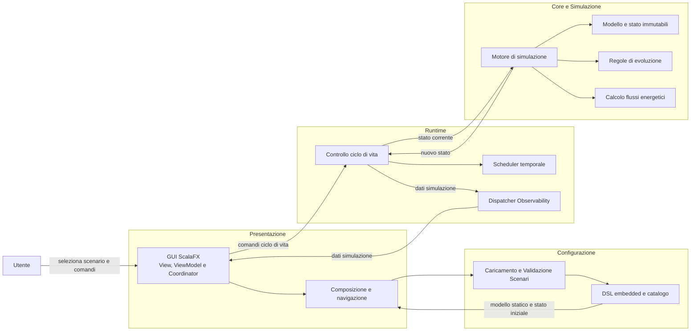

# Design Architetturale

## 1. Obiettivi e criteri di progettazione

GridSim è un simulatore a tempo discreto per micro-grid energetiche. Il sistema modella una rete come un grafo di entità energetiche e collegamenti fisici, configura scenari tramite una DSL embedded in Scala ed espone una GUI desktop per avviare, controllare e osservare l’esecuzione.

L’architettura è stata definita per soddisfare quattro qualità principali:
- **Correttezza e testabilità del calcolo simulativo**: ottenute separando le regole energetiche dagli "effetti collaterali" (KISS, tutto ciò che è derivato);
- **Manutenibilità**: tramite responsabilità coese (SRP) e contratti espliciti tra i sottosistemi;
- **Estendibilità**: in particolare verso nuovi tipi di entità, strategie di evoluzione, algoritmi di power flow e nuove statistiche;
- **Reattività della GUI**: evitando che la pianificazione dei tick o la distribuzione degli aggiornamenti blocchino il thread di presentazione.

---

## 2. Divisione in Macro-Componenti e Stile Architetturale

La struttura del sistema si articola in quattro macro-componenti principali indipendenti per garantire coesione e basso accoppiamento:

- **Core (Motore di Simulazione):** Il nucleo del sistema. Riceve in ingresso uno stato, calcola la transizione in modo puramente funzionale e restituisce lo stato successivo senza mutare riferimenti esterni.
- **DSL (Domain Specific Language):** Un layer sintattico embedded in Scala che semplifica la modellazione di una simulazione e traduce le dichiarazioni dell'utente nei modelli e nello stato iniziale.
- **Statistics (Metriche):** Modulo dedicato all'elaborazione delle metriche, isolato dal Core. Utilizza le API di Observability messe a disposizione dal core per raccogliere i dati.
- **GUI (Interfaccia Utente):** Componente basato su ScalaFX per il rendering in tempo reale e la gestione della simulazione.

L’architettura di GridSim adotta una combinazione di pattern architetturali complementari (maggiormente dettagliati nel documento di design di dettaglio):
- **Functional Core, Imperative Shell**: per separare il calcolo deterministico e puro della simulazione dalla gestione degli effetti collaterali esterni.
- **Architettura Event-driven (Observer)**: per disaccoppiare la produzione dei dati (motore) dal loro consumo (GUI e statistiche).
- **MVVM (Model-View-ViewModel)**: per strutturare l'interfaccia utente separando grafiche, stato reattivo e modelli di dominio.

---

## 3. Vista architetturale di contesto

Il diagramma seguente mostra i principali sottosistemi e il flusso generale dei comandi (da Utente a Core) e dei dati (da Core a GUI):

---

### 3.1. Componenti principali e scambio dei dati

La seguente tabella riassume in maniera generica le responsabilità dei blocchi illustrati nel diagramma di contesto:

| Componente                | Responsabilità architetturale                        | Dati in ingresso                     | Dati prodotti                                   |
|---------------------------|------------------------------------------------------|--------------------------------------|-------------------------------------------------|
| **Motore di simulazione** | Esegue transizione da stato a stato.                 | Stato, modello e strategie.          | Nuovo stato immutabile.                         |
| **Evoluzione entità**     | Risolve comportamento di case, accumulatori, ecc.    | Stato dell'entità locale, ambiente.  | Stato dell'entità e flusso di energia netto.    |
| **Power-flow solver**     | Determina il carico sui cavi dalla rete elettrica.   | Flussi energetici dei nodi e grafo.  | Carichi sui cavi.                               |
| **Observability**         | Disaccoppia l'esecuzione dai consumatori.            | Nuovi dati simulazione.              | Eventi/Snapshot verso GUI.                      |
| **Configurazione / DSL**  | Espone scenari e costruisce la simulazione iniziale. | Identificativo preset e durata tick. | Configurazione iniziale: griglia e durata tick. |
| **Runtime e controller**  | Gestisce il ciclo di vita (avvio, pausa, step).      | Comandi GUI e stato corrente.        | Invocazione motore e pubblicazione stato.       |
| **GUI**                   | Traduce dominio in stato di presentazione.           | Snapshot e controller.               | Proprietà osservabili.                          |

---

[Sommario](index.md) |
[Capitolo precedente](03-requirements.md) |
[Capitolo successivo](05-detailed-design.md)
