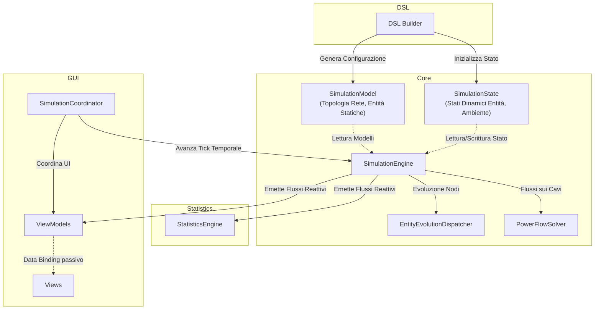

# Design Architetturale

## 1. Divisione in Moduli / Macro-Componenti
La struttura del sistema si articola in quattro macro-componenti principali indipendenti per garantire coesione e basso accoppiamento:

- **Core (Motore di Simulazione):** Il nucleo del sistema, implementato in modo puramente funzionale. Definisce i modelli statici e dinamici delle entità (`core.model`), le logiche di evoluzione (`core.behaviour`) e le regole di transizione di stato ad ogni tick (`core.simulation`). È un motore totalmente puro: riceve in ingresso uno stato, non muta riferimenti esterni e restituisce semplicemente lo stato successivo.
- **Statistics (Analisi e Metriche):** Modulo dedicato all'elaborazione delle metriche, isolato dal core della simulazione (`statistics`). Contiene l'engine statistico e il registro per calcolare, aggregare e conservare lo storico dei dati quantitativi (es. bilanci energetici) prodotti dalla simulazione.
- **GUI (Interfaccia Utente):** Componente basato su JavaFX/ScalaFX (`gui.view`, `gui.viewmodel`). Sfrutta il pattern **MVVM (Model-View-ViewModel)** per il rendering e l'aggiornamento in tempo reale dello stato della griglia, dei dettagli entità e dei grafici di andamento.
- **DSL (Domain Specific Language):** Un layer sintattico embedded in Scala (`dsl.grid`, `dsl.scenarios`) che espone in modo fluido e leggibile le primitive per configurare la simulazione. Traduce le dichiarazioni dell'utente nei modelli delle entità e nello stato iniziale pronto per l'Engine.

## 2. Architettura dell'engine (Separazione Dati, Logica e Orchestrazione)
Il design del segue rigidamente il principio di separazione tra dati, logica di calcolo e orchestrazione degli effetti, sfruttando ampiamente concetti di programmazione funzionale.

- **Modelli Dati (Pure Data):**
  - *Modelli Statici e Dinamici:* Viene mantenuta una rigorosa distinzione tra la configurazione statica e invariante di un'entità (es. `House`, `SolarPanel`) e il suo stato mutevole che evolve nel tempo a runtime (es. `HouseState`, `SolarPanelState`).
  - *Astrazione Unificata (GridEntity):* Tutti gli elementi connessi alla rete implementano astrazioni comuni (`GridEntity`, `GridEntityState`). Questo permette al ciclo di simulazione di trattarli uniformemente.
- **Logica di Dominio (Pattern Strategy, Type Classes ed Extension Methods):**
  Le operazioni matematiche e le logiche evolutive sono isolate e fortemente polimorfiche:
  - *Strategy Pattern:* Ampiamente utilizzato per definire i comportamenti specifici di consumo o produzione (es. `ConsumptionStrategy`, `StorageStrategy`) e per scambiare facilmente gli algoritmi di calcolo di distribuzione della potenza in rete (`PowerFlowSolver` come `KirchhoffPowerFlowSolver` o `SimplePowerFlowSolver`).
  - *Type Classes e Context Parameters:* Costrutti nativi di Scala 3 (`given` e `using`) sono usati estensivamente per l'injection di dipendenze context-bound (es. `EvolutionContext`, `ConsumptionResolver`), evitando di inquinare i costruttori o le signature pubbliche dei metodi.
  - *Extension Methods:* Sono impiegati per arricchire i puri record di stato (come `HouseState`) con le capacità evolutive tramite il type class pattern `GridEvolution` (es. `def evolve(...)`), preservando la purezza strutturale dei dati ed estraendo i comportamenti in oggetti separati (`HouseEvolution`).
- **Orchestration (State Monad):**
  Il sequenziamento delle operazioni all'interno della `DefaultSimulationEngine` è orchestrato mediante la monade `State[SimulationState, A]` offerta dalla libreria **Cats**. L'aggiornamento dell'ambiente, l'evoluzione delle entità e il calcolo dei carichi di potenza sono combinati come pura trasformazione sequenziale e funzionale.

## 3. Gestione dello Stato e Ciclo Temporale (Simulation Loop)
La simulazione viene modellata come una serie di transizioni di stato pure guidate da un runner esterno.

- **La Singola Transizione di Stato (Il Tick):**
  Un singolo passo temporale è una transizione pura eseguita dalla `SimulationEngine`, calcolata seguendo uno stretto ordine di dipendenza:
  1. *Aggiornamento dell'Ambiente:* Modifica dell'ora solare, temperatura e radianza.
  2. *Evoluzione delle Entità:* Delegata all'`EntityEvolutionDispatcher`, ogni entità calcola il proprio nuovo stato interno e l'energia netta residua (surplus o deficit). Tale calcolo rispetta un preciso ordine di esecuzione locale (es. un'abitazione risolve prima i consumi base, poi i produttori solari e, infine, bilancia gli accumulatori prima di scambiare con la rete).
  3. *Risoluzione dei Flussi sui Cavi:* Calcolo dell'intensità di potenza trasferita su ciascun cavo fisico della rete.

- **Gestione dell'Osservabilità (Event Dispatching e Flussi Reattivi):**
  L'engine di dominio non effettua I/O né push di dati per preservare la propria natura funzionale. Il lato reattivo è delegato all'interfaccia utente (strato runtime/coordinator):
  - Il calcolo dei "tick" genera nuovi stati `SimulationState` che vengono incanalati all'interno di flussi continui asincroni.
  - Un modulo apposito di Dispatching si occupa di sezionare e smistare in modo reattivo le varie parti dello stato di simulazione (ambiente, metriche, stato delle entità) su canali dedicati. Questo assicura isolamento, asincronia e disaccoppiamento estremo tra l'esecuzione pura del modello e i molteplici listener di sistema.

## 4. Architettura dell'Interfaccia Utente (MVVM e Flusso Reattivo)
L'interfaccia grafica si integra con i canali reattivi del sistema impiegando un solido pattern **Model-View-ViewModel (MVVM)**, ottimizzato per mantenere un Flusso Dati Unidirezionale pulito:

- **View:** Componenti ScalaFX puramente dichiarativi (`ViewFX`) che si occupano di definire i layout e gestire gli aspetti visivi della simulazione (es. `GridGraphView`, `StatisticsView`). Non contengono logica se non i binding passivi diretti verso le proprietà esposte dai ViewModel.
- **ViewModel:** Oggetti intermediari che astraggono lo stato GUI per le specifiche view (es. `SimulationSummaryViewModel`, `FlowStatisticViewModel`). Sottoscrivono i canali dati della simulazione e ne traducono gli aggiornamenti in proprietà mutabili ScalaFX (`ObjectProperty` ecc.), forzando e isolando il ricalcolo sul thread grafico (`Platform.runLater`).
- **Coordinator:** Il `SimulationCoordinator` funge da raccordo e orchestratore principale. Inizializza tutte le registrazioni ai canali della simulazione e coordina le reazioni a cascata sui vari ViewModel, centralizzando in tal modo le dipendenze al motore e ripulendo i ViewModel stessi.

[Sommario](index.md) |
[Capitolo precedente](03-requirements.md) |
[Capitolo successivo](05-detailed_design/05-detailed_design.md)
