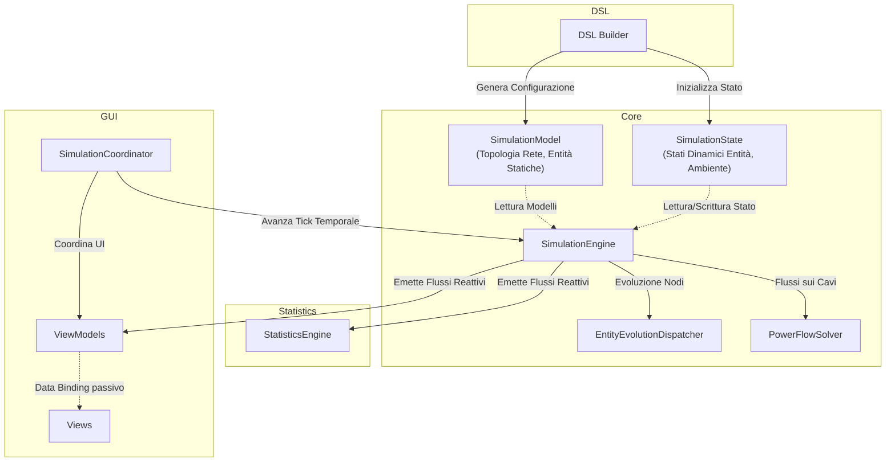
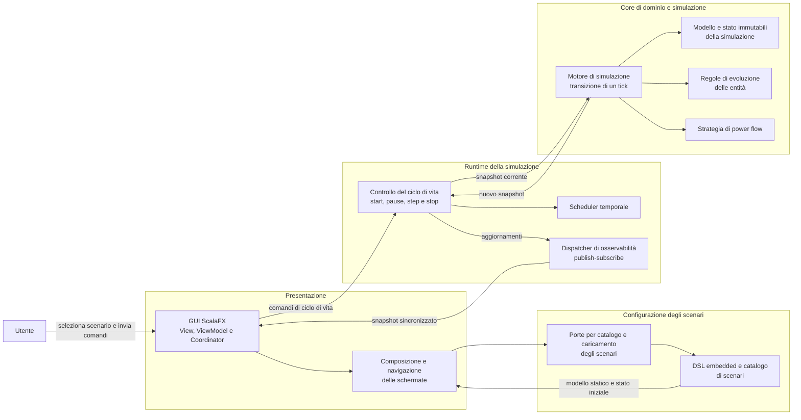
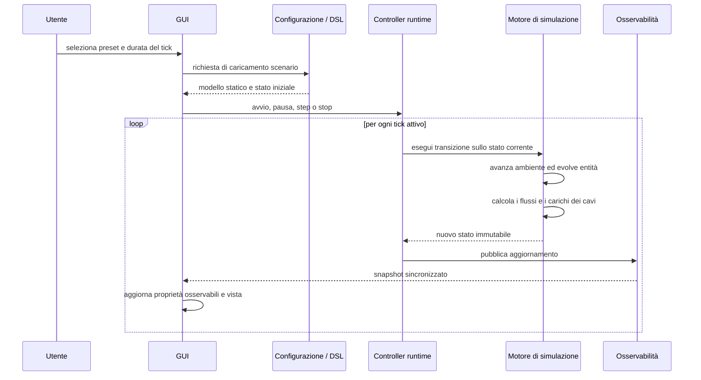

# Design Architetturale

## 1. Obiettivi e criteri di progettazione

<<<<<<< HEAD
- **Core (Motore di Simulazione):** Il nucleo del sistema, implementato in modo puramente funzionale. Definisce i modelli statici e dinamici delle entità (`core.model`), le logiche di evoluzione (`core.behaviour`) e le regole di transizione di stato ad ogni tick (`core.simulation`). È un motore totalmente puro: riceve in ingresso uno stato, non muta riferimenti esterni e restituisce semplicemente lo stato successivo.
- **Statistics (Analisi e Metriche):** Modulo dedicato all'elaborazione delle metriche, isolato dal core della simulazione (`statistics`). Contiene l'engine statistico e il registro per calcolare, aggregare e conservare lo storico dei dati quantitativi (es. bilanci energetici) prodotti dalla simulazione.
- **GUI (Interfaccia Utente):** Componente basato su JavaFX/ScalaFX (`gui.view`, `gui.viewmodel`). Sfrutta il pattern **MVVM (Model-View-ViewModel)** per il rendering e l'aggiornamento in tempo reale dello stato della griglia, dei dettagli entità e dei grafici di andamento.
- **DSL (Domain Specific Language):** Un layer sintattico embedded in Scala (`dsl.grid`, `dsl.scenarios`) che espone in modo fluido e leggibile le primitive per configurare la simulazione. Traduce le dichiarazioni dell'utente nei modelli delle entità e nello stato iniziale pronto per l'Engine.

## 2. Architettura dell'engine (Separazione Dati, Logica e Orchestrazione)
Il design del segue rigidamente il principio di separazione tra dati, logica di calcolo e orchestrazione degli effetti, sfruttando ampiamente concetti di programmazione funzionale.

- **Modelli Dati (Pure Data):**
  - *Modelli Statici e Dinamici:* Viene mantenuta una rigorosa distinzione tra la configurazione statica e invariante di un'entità (es. `House`, `SolarPanel`) e il suo stato mutevole che evolve nel tempo a runtime (es. `HouseState`, `SolarPanelState`).
  - *Astrazione Unificata (GridEntity):* Tutti gli elementi connessi alla rete implementano astrazioni comuni (`GridEntity`, `GridEntityState`). Questo permette al ciclo di simulazione di trattarli uniformemente.
- **Logica di Dominio (Pattern Strategy, Type Classes ed Extension Methods):**
  Le operazioni matematiche e le logiche evolutive sono isolate e fortemente polimorfiche:
  - *Strategy Pattern:* Ampiamente utilizzato per definire i comportamenti specifici di consumo o produzione (es. `ConsumptionStrategy`, `StorageStrategy`) e per scambiare facilmente gli algoritmi di calcolo di distribuzione della potenza in rete (`PowerFlowSolver` come `KirchhoffPowerFlowSolver` o `SimplePowerFlowSolver`).
  - *Type Classes e Context Parameters:* Costrutti nativi di Scala 3 (`given` e `using`) sono usati estensivamente per l'injection di dipendenze context-bound (es. `EvolutionContext`, `ConsumptionResolver`), evitando di inquinare i costruttori o le signature pubbliche dei metodi.
  - *Extension Methods:* Sono impiegati per arricchire i puri record di stato (come `HouseState`) con le capacità evolutive tramite il type class pattern `GridEvolution` (es. `def evolve(...)`), preservando la purezza strutturale dei dati ed estraendo i comportamenti in oggetti separati (`HouseEvolution`).
- **Orchestration (State Monad):**
  Il sequenziamento delle operazioni all'interno della `DefaultSimulationEngine` è orchestrato mediante la monade `State[SimulationState, A]` offerta dalla libreria **Cats**. L'aggiornamento dell'ambiente, l'evoluzione delle entità e il calcolo dei carichi di potenza sono combinati come pura trasformazione sequenziale e funzionale.

## 3. Gestione dello Stato e Ciclo Temporale (Simulation Loop)
La simulazione viene modellata come una serie di transizioni di stato pure guidate da un runner esterno.

- **La Singola Transizione di Stato (Il Tick):**
  Un singolo passo temporale è una transizione pura eseguita dalla `SimulationEngine`, calcolata seguendo uno stretto ordine di dipendenza:
  1. *Aggiornamento dell'Ambiente:* Modifica dell'ora solare, temperatura e radianza.
  2. *Evoluzione delle Entità:* Delegata all'`EntityEvolutionDispatcher`, ogni entità calcola il proprio nuovo stato interno e l'energia netta residua (surplus o deficit). Tale calcolo rispetta un preciso ordine di esecuzione locale (es. un'abitazione risolve prima i consumi base, poi i produttori solari e, infine, bilancia gli accumulatori prima di scambiare con la rete).
  3. *Risoluzione dei Flussi sui Cavi:* Calcolo dell'intensità di potenza trasferita su ciascun cavo fisico della rete.

- **Gestione dell'Osservabilità (Event Dispatching e Flussi Reattivi):**
  L'engine di dominio non effettua I/O né push di dati per preservare la propria natura funzionale. Il lato reattivo è delegato all'interfaccia utente (strato runtime/coordinator):
  - Il calcolo dei "tick" genera nuovi stati `SimulationState` che vengono incanalati all'interno di flussi continui asincroni.
  - Un modulo apposito di Dispatching si occupa di sezionare e smistare in modo reattivo le varie parti dello stato di simulazione (ambiente, metriche, stato delle entità) su canali dedicati. Questo assicura isolamento, asincronia e disaccoppiamento estremo tra l'esecuzione pura del modello e i molteplici listener di sistema.

## 4. Architettura dell'Interfaccia Utente (MVVM e Flusso Reattivo)
L'interfaccia grafica si integra con i canali reattivi del sistema impiegando un solido pattern **Model-View-ViewModel (MVVM)**, ottimizzato per mantenere un Flusso Dati Unidirezionale pulito:

- **View:** Componenti ScalaFX puramente dichiarativi (`ViewFX`) che si occupano di definire i layout e gestire gli aspetti visivi della simulazione (es. `GridGraphView`, `StatisticsView`). Non contengono logica se non i binding passivi diretti verso le proprietà esposte dai ViewModel.
- **ViewModel:** Oggetti intermediari che astraggono lo stato GUI per le specifiche view (es. `SimulationSummaryViewModel`, `FlowStatisticViewModel`). Sottoscrivono i canali dati della simulazione e ne traducono gli aggiornamenti in proprietà mutabili ScalaFX (`ObjectProperty` ecc.), forzando e isolando il ricalcolo sul thread grafico (`Platform.runLater`).
- **Coordinator:** Il `SimulationCoordinator` funge da raccordo e orchestratore principale. Inizializza tutte le registrazioni ai canali della simulazione e coordina le reazioni a cascata sui vari ViewModel, centralizzando in tal modo le dipendenze al motore e ripulendo i ViewModel stessi.
=======
GridSim è un simulatore a tempo discreto per micro-grid energetiche. Il sistema modella una rete come un grafo di entità energetiche e collegamenti fisici, configura scenari tramite una DSL embedded in Scala ed espone una GUI desktop per avviare, controllare e osservare l’esecuzione.

L’architettura è stata definita per soddisfare quattro qualità principali:

- **correttezza e testabilità del calcolo simulativo**, ottenute separando le regole energetiche dagli effetti collaterali;
- **manutenibilità**, tramite responsabilità coese e contratti espliciti tra i sottosistemi;
- **estendibilità**, in particolare verso nuovi tipi di entità, strategie di evoluzione e algoritmi di power flow;
- **reattività della GUI**, evitando che la pianificazione dei tick o la distribuzione degli aggiornamenti blocchino il thread di presentazione.

Il progetto è distribuito come una singola applicazione Gradle, ma la struttura dei package identifica confini architetturali distinti: dominio e simulazione, DSL, runtime, osservabilità e interfaccia grafica. Il capitolo descrive tali confini ad alto livello; i tipi concreti, le formule energetiche e i dettagli algoritmici sono trattati nel design di dettaglio.

---

## 2. Stile architetturale adottato

L’architettura di GridSim non coincide con un unico pattern. È più accurato descriverla come una combinazione di quattro scelte complementari:

1. **architettura domain-centred con Functional Core, Imperative Shell** per il motore di simulazione;
2. **Publish-Subscribe Event-Driven** per distribuire gli aggiornamenti della simulazione;
3. **MVVM** per la GUI ScalaFX.

Questa combinazione è particolarmente adatta a un simulatore: il calcolo energetico deve restare deterministico e verificabile, mentre timer, concorrenza, DSL e GUI devono poter evolvere senza alterare le regole del dominio.

### 2.1 Functional Core, Imperative Shell

Il nucleo del sistema è una transizione di stato discreta:

$$S_{t+1} = step(S_t)$$

Lo stato della simulazione è immutabile: un tick non modifica lo snapshot ricevuto, ma costruisce il successivo. La parte funzionale del sistema comprende il modello della rete, l’ambiente, gli stati dinamici delle entità, le regole di evoluzione e il calcolo dei flussi. Essa è quindi indipendente da GUI, thread, timer e I/O.

La shell imperativa gestisce invece gli aspetti necessariamente effectful: avvio, pausa e arresto della simulazione; pianificazione periodica dei tick; conservazione dello snapshot corrente; pubblicazione degli aggiornamenti e trasferimento di tali aggiornamenti nel thread JavaFX.

Questa separazione è ideale per GridSim perché consente di verificare il comportamento della simulazione come una normale funzione: dato uno scenario iniziale, il risultato di ogni tick è riproducibile e testabile senza avviare la GUI o risorse concorrenti.

### 2.2 Event-driven publish-subscribe

Al termine di ogni tick, il runtime pubblica uno snapshot aggiornato tramite un dispatcher di osservabilità. Gli osservatori possono richiedere dati granulari — ambiente, stati delle entità, flussi o carichi dei cavi — oppure uno snapshot sincronizzato completo.

Il meccanismo implementa un pattern **Observer / Publish-Subscribe**: il produttore dello stato non conosce i consumatori specifici. La GUI è quindi solo uno dei possibili destinatari; lo stesso canale può supportare in futuro analytics, persistenza della storia, esportazione o monitoraggio esterno.

Questo non costituisce Event Sourcing: gli eventi sono notifiche dello stato corrente e non un log persistito usato per ricostruire la simulazione.

### 2.3 MVVM

La GUI non adotta MVC classico, ma il pattern **Model-View-ViewModel (MVVM)**. Le View ScalaFX dichiarano layout e binding; i ViewModel espongono proprietà osservabili e comandi legati alla presentazione; il Model è rappresentato dagli oggetti di dominio e dalla sessione di simulazione attiva.

Un coordinator collega lo stream degli aggiornamenti proveniente dal runtime ai diversi ViewModel della dashboard. Esso centralizza il passaggio dal contesto asincrono al thread JavaFX e impedisce che ciascuna View debba conoscere dettagli di concorrenza o osservabilità.

---

## 3. Vista architetturale di contesto

Il diagramma seguente mostra i principali sottosistemi e il flusso delle responsabilità.

Il diagramma evidenzia una distinzione fondamentale. La GUI, la DSL, lo scheduler e il dispatcher appartengono ai bordi dell’applicazione; il motore e il dominio energetico occupano il centro. Il flusso dei comandi procede dall’utente verso il core, mentre il flusso dei dati aggiornati procede dal core verso la GUI attraverso il canale di osservabilità.

---

## 4. Componenti principali e scambio dei dati

| Componente | Responsabilità architetturale | Dati in ingresso | Dati prodotti / collaborazioni |
|---|---|---|---|
| **Presentazione e navigazione** | Avvia l’applicazione, mantiene la schermata corrente e compone le dipendenze della GUI. | Eventi di navigazione e sessioni di simulazione create. | Selezione dello scenario o dashboard della simulazione. |
| **Configurazione degli scenari** | Espone gli scenari disponibili, valida la richiesta dell’utente e costruisce una simulazione iniziale. | Identificativo del preset e durata simulata del tick. | `SimulationModel` e `SimulationState` iniziali, oppure errori di configurazione. |
| **DSL** | Offre una sintassi specifica del dominio per descrivere entità, componenti, topologia e tempo simulato. | Dichiarazioni degli scenari. | Configurazione validata della micro-grid. |
| **Runtime e controller** | Gestisce il ciclo di vita effectful della sessione: avvio, pausa, ripresa, avanzamento singolo e arresto. | Comandi della GUI e stato corrente. | Invocazione periodica del motore e pubblicazione dello stato aggiornato. |
| **Motore di simulazione** | Esegue una transizione completa da uno snapshot discreto al successivo. | Stato corrente, modello statico e strategie configurate. | Nuovo stato immutabile della simulazione. |
| **Evoluzione delle entità** | Risolve il comportamento locale di case, produttori e sistemi di accumulo. | Stato dinamico, entità statica, ambiente e durata del tick. | Stato locale aggiornato e flusso energetico netto dell’entità. |
| **Power-flow solver** | Determina il carico trasferito sui cavi a partire dai flussi netti dei nodi e dalla topologia. | Flussi delle entità e grafo della micro-grid. | Mappa dei carichi sui cavi. |
| **Osservabilità** | Disaccoppia l’esecuzione della simulazione dai suoi consumatori. | Nuovo snapshot della simulazione. | Eventi tipizzati o snapshot sincronizzati per GUI e futuri observer. |
| **GUI** | Traduce i dati di dominio in stato di presentazione e rende disponibili i comandi dell’utente. | Snapshot e stato del controller. | Proprietà osservabili, comandi e aggiornamento delle View. |

### 4.1 Contratti informativi fondamentali

La separazione tra dati statici e dinamici è il principale contratto interno del sistema:

- **`SimulationModel`** descrive gli elementi invarianti durante una sessione: grafo della micro-grid, entità, cavi e durata simulata di un tick.
- **`SimulationState`** descrive uno snapshot dinamico: ambiente e tempo simulato, stati delle entità, flussi netti e carichi dei cavi.
- **`SimulationSnapshot`** è la vista coerente dei dati emessa verso gli observer alla fine di un tick.

Il grafo della micro-grid è formato da nodi energetici e cavi. I cavi rappresentano connessioni non orientate con una capacità massima, mentre la rete esterna funge da nodo di bilanciamento. Questo modello consente di rappresentare sia reti radiali sia, mediante un solver appropriato, topologie magliate.

La distinzione tra modello e stato evita che la configurazione della rete venga modificata durante l’esecuzione. Inoltre rende naturale conservare o confrontare snapshot diversi, poiché ciascun tick produce un nuovo valore senza distruggere quello precedente.

---

## 5. Ciclo di vita della simulazione

La sequenza seguente descrive il flusso principale, dal caricamento di uno scenario all’aggiornamento della dashboard.

Nel caricamento dello scenario, la DSL crea un modello statico e lo stato iniziale coerente con esso. La GUI non costruisce direttamente le entità di dominio: si limita a richiedere il caricamento attraverso le porte dedicate e a gestire eventuali errori di validazione.

Durante l’esecuzione, il controller mantiene lo stato della sessione e decide quando richiedere un nuovo tick. Il motore rimane invece focalizzato sulla transizione deterministica: aggiorna l’ambiente, evolve le entità e calcola il power flow. Terminato il calcolo, il runtime pubblica i dati aggiornati senza introdurre una dipendenza diretta tra motore e GUI.

---

## 6. Core di dominio e strategie di calcolo

Il core rappresenta una micro-grid come un grafo di entità energetiche. Le abitazioni possono incapsulare componenti locali, quali produzione fotovoltaica e accumulo; i produttori e gli accumulatori possono inoltre partecipare al bilancio della rete secondo il modello configurato.

L’evoluzione delle entità è separata dalla topologia della rete. Ogni entità determina innanzitutto il proprio flusso energetico residuo in funzione dello stato, dell’ambiente e della durata del tick. Il motore raccoglie tali flussi e li passa al solver, che è responsabile della distribuzione sulle connessioni fisiche.

La separazione tra evoluzione locale e power flow rappresenta una scelta importante per la manutenibilità:

- le regole di consumo, produzione e accumulo evolvono senza modificare l’algoritmo di rete;
- gli algoritmi di rete possono essere sostituiti senza riscrivere le entità;
- gli scenari DSL possono cambiare topologia senza alterare la logica della GUI.

Il sistema prevede infatti più strategie di power flow. Una strategia semplice è orientata a reti radiali e aggrega i flussi lungo un albero radicato nella rete esterna. Una seconda strategia applica un modello DC basato sulle leggi di Kirchhoff, permettendo di distribuire i flussi anche su topologie magliate. La scelta dell’algoritmo è quindi un punto di estensione architetturale, non una decisione incorporata nella GUI o nel ciclo di vita della simulazione.

>>>>>>> origin/feature/docs

[Sommario](index.md) |
[Capitolo precedente](03-requirements.md) |
[Capitolo successivo](05-detailed_design/05-detailed_design.md)
