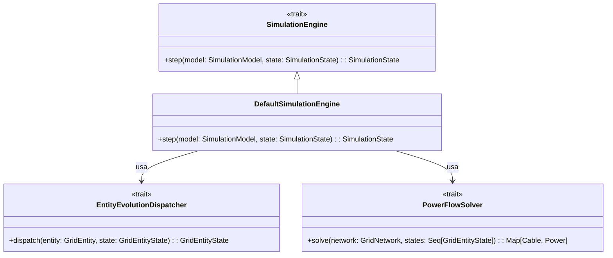
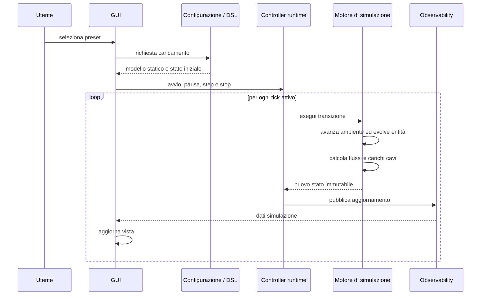

# Design di Dettaglio

Questa sezione approfondisce le scelte rilevanti di design, i pattern di progettazione adottati e l'organizzazione
interna del codice per i vari moduli descritti nel Design Architetturale.

## 1. Pattern di Progettazione nel Core (Domain e Simulation)

Il design dell'Engine segue rigidamente i principi della programmazione funzionale, separando i puri dati dalla logica
di dominio.

### 1.1 Functional Core, Imperative Shell

L'architettura "Functional core, imperative shell" separa nettamente il calcolo puro della simulazione (il *Functional
Core*) dalla gestione degli effetti collaterali esterni (la *Shell* imperativa).

Il **Functional Core** ospita il modello statico della rete, l'ambiente, le regole di evoluzione e gli algoritmi per il
calcolo dei flussi.
L'esecuzione logica all'interno di questo nucleo è modellata rigorosamente come una transizione di stato discreta:
$S_{t+1} = step(S_t)$.
Ricevendo in ingresso lo stato corrente $S_t$, il motore si limita a computare e restituire il nuovo stato $S_{t+1}$
senza mutare alcun riferimento esterno, garantendo così assoluta testabilità e determinismo.

La **Shell Imperativa** (il livello di runtime) funge invece da "contenitore" per il core e si occupa di tutto ciò che è
effectful: pianifica l'esecuzione dei thread, ascolta i comandi della GUI (avvio, pausa, arresto) e pubblica gli
aggiornamenti di stato in uscita, richiamando ciclicamente la funzione pura del motore.

### 1.2 Strutture Dati Principali (Modelli di Scambio)

Per supportare questa separazione, il sistema disaccoppia i macro-componenti basando la comunicazione interna su tre
oggetti dati immutabili e fondamentali:
- **`SimulationModel`**: Descrive la configurazione statica e invariante della rete costruita dalla DSL all'avvio (la
  struttura del grafo della micro-grid, i componenti fisici presenti, le loro capacità e la durata temporale fissa di un
  tick).
- **`SimulationState`**: Descrive lo stato dinamico e mutevole della rete al momento corrente (l'orario, l'ambiente,
  l'energia istantanea delle batterie, i flussi netti, i carichi di energia che passano sui cavi). Rappresenta lo stato
  che evolve ad ogni transizione.
- **`SimulationSnapshot` e dati simulazione**: Le informazioni generate e "impacchettate" alla fine di ogni tick, che
  raggruppano in modo coerente e read-only le informazioni di stato e di flusso per poterle trasmettere all'esterno
  verso la GUI e l'engine statistico (tramite l'observability).

### 1.3 Modelli Dati Interni (GridEntity)

- **Modelli Statici e Dinamici:** Oltre alla macro-separazione tra `SimulationModel` e `SimulationState`, anche
  internamente viene mantenuta una rigorosa distinzione tra la configurazione statica di un'entità (es. `House`,
  `SolarPanel`) e il suo stato mutevole (es. `HouseState`, `SolarPanelState`).
- **Astrazione Unificata:** Tutti gli elementi implementano astrazioni comuni (`GridEntity`, `GridEntityState`),
  permettendo al motore di trattarli uniformemente in collezioni.

### 1.4 Logica di Dominio (Pattern e Funzionalità Scala 3)

Le operazioni matematiche e le logiche evolutive sono isolate e fortemente polimorfiche, sfruttando diverse feature
tipiche di Scala:
- **Strategy Pattern:** Ampiamente utilizzato per definire i comportamenti specifici di consumo o produzione (es.
  `ConsumptionStrategy`, `StorageStrategy`) e per scambiare facilmente gli algoritmi del `PowerFlowSolver` (es.
  `KirchhoffPowerFlowSolver` o una strategia radiale semplificata).
- **Type Classes e Context Parameters:** Costrutti nativi (`given` e `using`) sono usati estensivamente per la
  dependency injection a compile-time (es. `EvolutionContext`, `ConsumptionResolver`), evitando di inquinare i
  costruttori.
- **Extension Methods:** Impiegati per arricchire i record di stato puri con le capacità evolutive tramite il pattern
  type class `GridEvolution` (es. `def evolve(...)`), estraendo i comportamenti in oggetti separati.

### 1.5 Orchestrazione (State Monad)

Il sequenziamento delle operazioni all'interno della `DefaultSimulationEngine` è orchestrato mediante la monade
`State[SimulationState, A]` offerta dalla libreria **Cats**.
L'aggiornamento dell'ambiente, l'evoluzione delle entità e il calcolo dei flussi sono combinati come pura trasformazione
funzionale.

---

## 2. Gestione dello Stato e Ciclo Temporale (Simulation Loop)

La simulazione evolve attraverso transizioni pure orchestrate da un loop esterno.

### 2.1 La Singola Transizione di Stato (Il Tick)

La transizione calcolata dall'engine segue uno stretto ordine logico:
1. **Aggiornamento dell'Ambiente:** Modifica dell'ora solare, temperatura e radianza.
2. **Evoluzione delle Entità:** Delegata all'`EntityEvolutionDispatcher`, ogni entità calcola il nuovo stato interno e l'energia netta. Viene rispettato l'ordine locale (es. un'abitazione consuma prima localmente, poi bilancia l'accumulatore e infine scambia energia con la rete).
3. **Risoluzione dei Flussi sui Cavi:** Il solver distribuisce la potenza sulla rete fisica basandosi sui flussi netti dei nodi.

### 2.2 Ciclo di vita e Interazioni

Il seguente diagramma di sequenza mostra l'interazione tra i componenti nel corso dell'esecuzione della simulazione, dal
caricamento al loop periodico dei tick.

### 2.3 Osservabilità e Flussi Reattivi (Pattern Observer)

Al termine di ogni tick, l'engine non effettua alcun push di dati. I nuovi stati `SimulationState` prodotti vengono
presi in carico dal lato runtime e incanalati in flussi asincroni continui. Un **Dispatcher** smista sezioni dello stato
su canali reattivi, agendo da fulcro per un pattern **Event-driven Publish-Subscribe** (o Observer).
Il produttore dello stato (Core) non conosce i consumatori, consentendo un totale disaccoppiamento e l'aggiunta futura
di qualsiasi tipo di componente interessato alla simulazione (es. server di telemetria esterni).

---

## 3. Architettura dell'Interfaccia Utente (MVVM)

L'interfaccia grafica si integra ai canali reattivi del Dispatcher applicando il pattern **Model-View-ViewModel (MVVM)**
con un flusso dati unidirezionale.

- **View (`ViewFX`):** Componenti puramente dichiarativi per layout e grafica visiva (es. `GridGraphView`). Definiscono
  solo binding passivi verso le proprietà esposte dai ViewModel.
- **ViewModel:** Oggetti intermedi (es. `SimulationSummaryViewModel`) che astraggono lo stato. Sottoscrivono i canali
  della simulazione, elaborano i dati e aggiornano proprietà reattive (`ObjectProperty`) forzando e isolando il
  ricalcolo e gli aggiornamenti grafici sul thread principale JavaFX (`Platform.runLater`).
- **Coordinator:** `SimulationCoordinator` funge da raccordo e orchestratore principale. Centralizza la gestione delle
  sottoscrizioni asincrone ai canali della simulazione e le distribuisce ai ViewModel, rimuovendo così ogni conoscenza
  diretta dei task asincroni dalle View.

---

## 4. Configurazione e Validazione tramite DSL

La costruzione degli scenari (entità, topologia e regole) sfrutta la **Scala 3 DSL**:
- **Context Functions e Builder Pattern:** Iniezione implicita del contesto tramite `?=>`, favorendo una sintassi ad
  albero (es. `simulation { house: ... }`).
- **Infix Extension Methods:** Permettono una notazione naturale e immutabile (es. `capacity 10.kwh`), concatenando
  parametri opzionali fluidamente.
- **Validazione Sicura Accumulativa:** Il costrutto logico si basa sul funtore applicativo `ValidatedNec` di **Cats**,
  in grado di ispezionare tutti i parametri di un'entità e accumulare una lista completa degli eventuali errori
  semantici/sintattici omettendo l'utilizzo di eccezioni.

---

[Sommario](index.md) |
[Capitolo precedente](04-architectural_design.md) |
[Capitolo successivo](06-testing.md)
