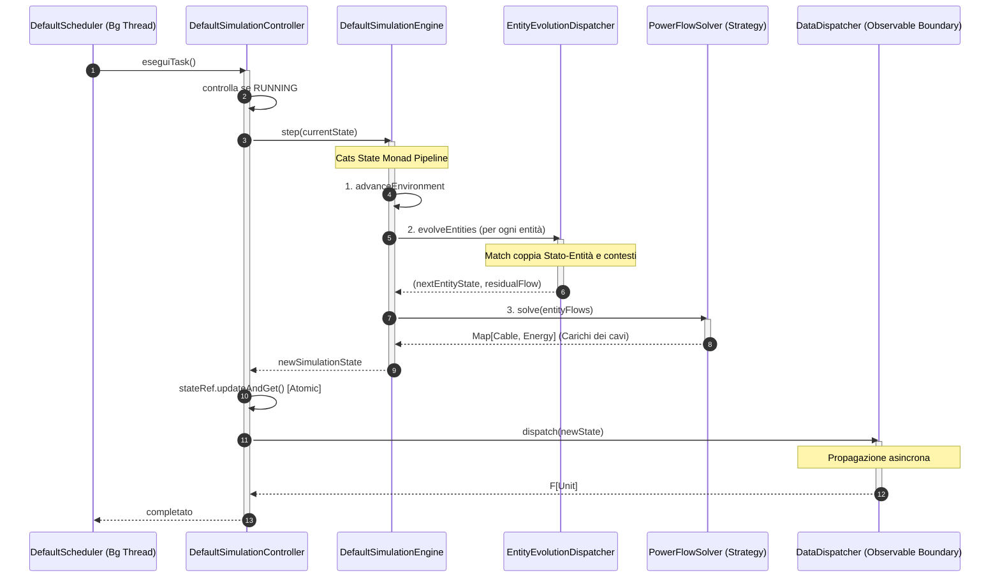
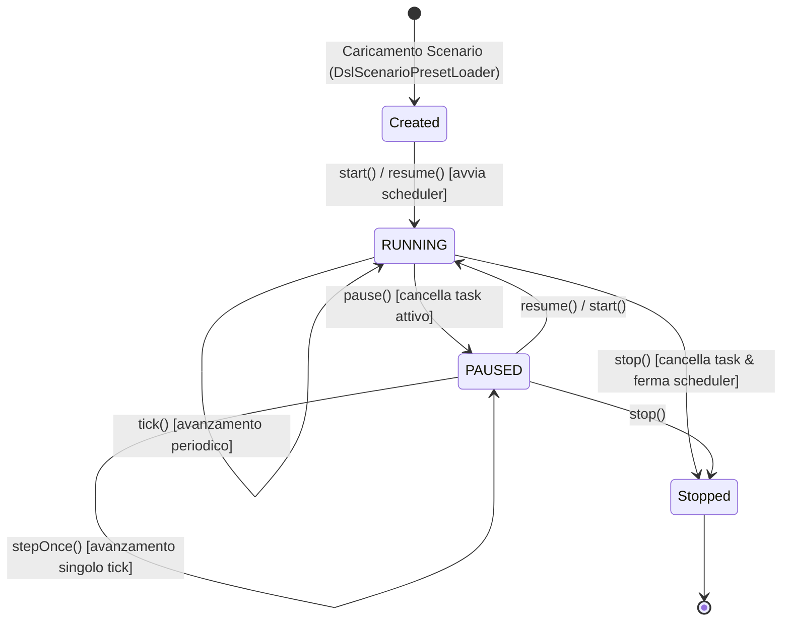
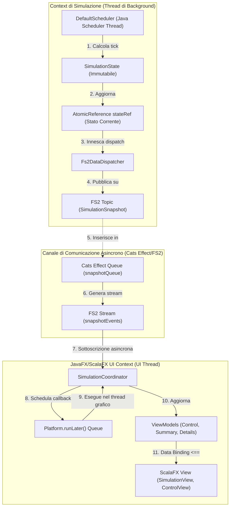
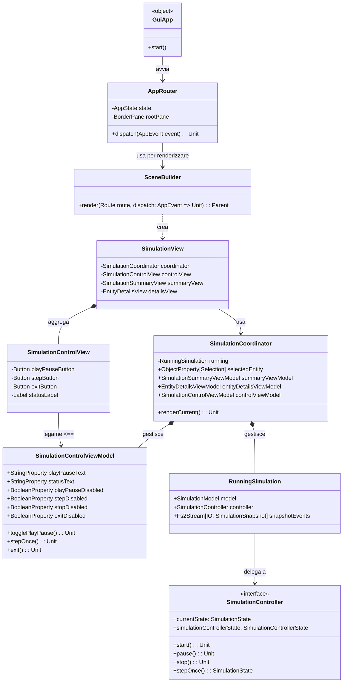
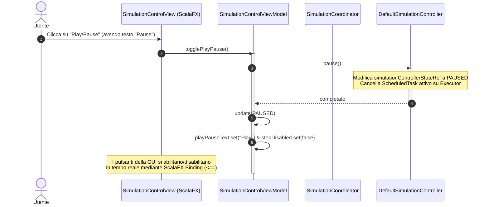

# 5. Design di Dettaglio

Il design di dettaglio di **GridSim** traduce le decisioni macro-architetturali in scelte tecnologiche specifiche, pattern implementativi e moduli di codice strutturati in Scala 3. Questo capitolo approfondisce quattro aree fondamentali del sistema, descrivendone le scelte di design, i pattern e i diagrammi rigorosi basati sull'analisi diretta del codice sorgente:
1. Il **Domain Core** (modellazione energetica e validazione degli invarianti);
2. Il **Simulatore** (motore di avanzamento temporale, Cats State monad e scheduler concorrente);
3. Il **Pattern Observable** (il canale di comunicazione asincrono e reattivo basato su FS2 e Cats Effect);
4. La **GUI** (struttura dell'interfaccia utente dinamica in ScalaFX, binding ed MVVM).

---

## 5.1 Il Domain Core (Modello del Dominio)

Il Domain Core rappresenta il cuore logico e fisico-matematico di GridSim. Si basa sui paradigmi della programmazione funzionale, dell'immutabilità dello stato e della type safety statica.

### 5.1.1 Scelte Rilevanti di Design

1. **Separazione tra Modello Statico (`GridEntity`) e Stato Dinamico (`GridEntityState`)**:
   Le entità fisiche della rete elettrica (come `House`, `Battery`, `SolarPanel`) definiscono costanti strutturali immodificabili (es. area e rendimento nominale di un pannello, capacità di accumulo di una batteria, portata dei cavi). Lo stato runtime (es. livello di carica corrente di una batteria, produzione istantanea di un pannello, flusso energetico residuo di una casa) risiede in corrispondenti classi di stato separate che estendono `GridEntityState`. Questa netta separazione evita la duplicazione dei dati costanti in memoria e ottimizza lo spazio occupato dagli snapshot storici salvati per le analisi statistiche.
   
2. **Type Safety Dimensionale con Opaque Types**:
   Per evitare errori accidentali nello scambio di grandezze fisiche (es. sommare potenza ad energia, confondere kW con kWh), le grandezze fisiche sono modellate tramite **Tipi Opachi** (Opaque Types) di Scala 3:
   * `opaque type Power = Double` (Potenza espressa in kW)
   * `opaque type Energy = Double` (Energia espressa in kWh)
   * `opaque type Irradiance = Double` (Irraggiamento solare espresso in W/m²)
   
   Il compilatore blocca qualsiasi tentativo di assegnamento o operazione matematica diretta tra questi tipi senza una conversione esplicita mediata dalla durata del tick (es. `.toEnergy(using tick)`). A runtime, la JVM compila i tipi opachi in primitivi puri (`Double`), azzerando l'overhead di allocazione tipico dei wrapper classici.

3. **Validazione Funzionale Accumulativa e Invarianti**:
   L'integrità fisica e la coerenza del modello di dominio (es. che lo stato della batteria non dichiari un livello di carica superiore alla capacità dell'entità o che i cavi non abbiano portate negative) sono garantite mediante **Smart Constructors** e la type class `Validator[A]`. Le validazioni restituiscono `ValidatedNec[DomainError, A]`, accumulando tutti gli errori riscontrati in una lista coerente invece di fallire alla prima eccezione. Una volta ottenuto un modello validato, il simulatore può operare con invarianti forti.

4. **Modello ad Aggregati (Aggregates)**:
   La casa (`House`) è modellata come un aggregato locale che incapsula componenti energetici (es. pannelli solari e batterie). Invece di far interagire ogni componente singolarmente con la micro-grid, la casa risolve internamente il proprio bilancio energetico (1° consumo domestico, 2° produzione dei pannelli, 3° carica/scarica delle batterie locali) ed espone alla rete solo il flusso residuo (`Flow[Energy]` come `Surplus`, `Deficit` o `Balanced`).

### 5.1.2 Pattern di Progettazione

* **Type Class Pattern**:
  La logica di avanzamento temporale delle entità non è legata ad una gerarchia ad oggetti rigida. È invece definita tramite la type class `GridEvolution[S, E, C]`. L'evoluzione di specifiche entità (es. `HouseEvolution`, `SolarPanelEvolution`) è implementata esternamente come istanza `given`. Questo consente di aggiungere o modificare comportamenti fisici ed entità senza intaccare le definizioni dati originarie (rispetto dell'**Open-Closed Principle**).
  
* **Strategy Pattern**:
  Le variazioni di comportamento a runtime (es. come variano i consumi di una casa nelle 24 ore o come risponde un pannello fotovoltaico all'irraggiamento) sono isolate tramite strategie intercambiabili come `ConsumptionStrategy` e `ProducerStrategy`.
  
* **Smart Constructor**:
  I metodi statici `make` (es. `House.make`, `Battery.make`) fungono da factory controllate per istanziare coppie di entità e stato verificate.

### 5.1.3 Diagramma Classi del Domain Core

Il seguente diagramma descrive la gerarchia dei modelli statici, degli stati dinamici e il loro accoppiamento con le type class di evoluzione e validazione:

```mermaid
classDiagram
    direction TB

    %% Interfacce Base
    class GridEntity {
        <<interface>>
        +String id
    }

    class GridEntityState {
        <<interface>>
        +String entityId
    }

    %% Produttori (Producers)
    class Producer {
        <<interface>>
        +maxProduction: Power
    }
    class ProducerState {
        <<interface>>
        +currentProduction: Power
    }
    
    GridEntity <|-- Producer
    GridEntityState <|-- ProducerState

    class SolarPanel {
        +Double areaSqm
        +Double efficiency
        +Power maxProduction
        +SolarPanelPhysics physics
        +GeographicPoint location
    }
    class SolarPanelState {
        +Double efficiency
    }
    
    Producer <|-- SolarPanel
    ProducerState <|-- SolarPanelState

    %% Accumulatori (Storages)
    class Storage {
        <<interface>>
        +maxCapacity: Energy
    }
    class StorageState {
        <<interface>>
        +currentCharge: Energy
    }

    GridEntity <|-- Storage
    GridEntityState <|-- StorageState

    class Battery {
        +Energy maxCapacity
        +Power maxPowerCharge
        +Power maxPowerDischarge
        +Double minSoC
        +BatteryModel model
    }
    class BatteryState {
        +Energy currentCharge
    }

    Storage <|-- Battery
    StorageState <|-- BatteryState

    %% Utenze (House)
    class House {
        +List[GridEntity] components
        +ConsumptionStrategy strategy
    }
    class HouseState {
        +List[GridEntityState] componentStates
    }

    GridEntity <|-- House
    GridEntityState <|-- HouseState

    %% Connessioni e Rete (Topology)
    class CableConnections {
        +String n1
        +String n2
    }
    class Cable {
        +CableConnections connections
        +Power maxCapacity
    }
    class GridGraph {
        +Iterable[GridEntity] nodes
        +Iterable[Cable] cables
    }
    class ExternalGrid {
        +String id
    }
    GridEntity <|-- ExternalGrid

    %% Evoluzione e Contesto
    class GridEvolution~S, E, C~ {
        <<interface>>
        +evolve(state: S, entity: E, env: Environment)(using context: C): (S, Flow[Energy])
    }

    class EvolutionContext~D~ {
        +FiniteDuration delta
        +D dependencies
    }

    class HouseEvolutionDependencies {
        +ConsumptionResolver resolver
        +DemandShaper shaper
    }

    class ConsumptionResolver {
        <<interface>>
        +resolve(hour: Long, strategy: ConsumptionStrategy): Flow[Energy]
    }

    class DemandShaper {
        <<interface>>
        +shape(mean: Double, variance: Double): Double
    }

    class HouseEvolution {
        <<object>>
        +evolve(state: HouseState, house: House, env: Environment)(using context: EvolutionContext[HouseEvolutionDependencies]): (HouseState, Flow[Energy])
    }

    GridEvolution <|.. HouseEvolution : implements
    HouseEvolutionDependencies <-- EvolutionContext : avvolge
    HouseEvolutionDependencies --> ConsumptionResolver : usa
    HouseEvolutionDependencies --> DemandShaper : usa
    HouseEvolution ..> EvolutionContext : richiede

    %% Gestione dei flussi energetici (Exchangers)
    class StorageEnergyExchanger~S, E~ {
        <<interface>>
        +exchange(state: S, entity: E, flow: Flow[Energy], env: Environment)(using delta: FiniteDuration): (S, Flow[Energy])
    }

    class BatteryEnergyExchange {
        <<object>>
        +exchange(state: BatteryState, b: Battery, flow: Flow[Energy], env: Environment)(using delta: FiniteDuration): (BatteryState, Flow[Energy])
    }

    StorageEnergyExchanger <|.. BatteryEnergyExchange : implements
    HouseEvolution ..> StorageEnergyExchanger : delega a

    %% Validazione (Validators)
    class Validator~A~ {
        <<interface>>
        +validate(value: A): ValidatedNec[DomainError, A]
    }

    Validator ..> GridEntity : valida
```



---

## 5.2 Il Simulatore (Simulation Engine)

Il simulatore orchestra l'evoluzione temporale discreta della micro-grid, calcolando i flussi elettrici sui cavi e garantendo l'esecuzione coordinata di tutti i processi fisici.

### 5.2.1 Scelte Rilevanti di Design

1. **Architettura Functional Core / Imperative Shell**:
   Il calcolo dell'evoluzione per un singolo passo temporale $\Delta t$ è puramente funzionale: dato lo stato di simulazione attuale $S_t$ e l'ambiente $E_t$, restituisce in modo deterministico un nuovo stato $S_{t+1}$ ed una mappa dei flussi di rete. Questa logica pura risiede nel `SimulationEngine`. L'esecuzione temporale, l'avanzamento reale dell'orologio e la memorizzazione dello stato corrente a runtime risiedono invece nella "shell imperativa" (il `SimulationController`), che gestisce in modo sicuro lo stato mutabile.
   
2. **Esecuzione Asincrona e Non-Bloccante**:
   Per evitare che calcoli numerici pesanti (es. la risoluzione di grandi sistemi lineari di flussi su reti magliate) provochino il congelamento dell'interfaccia grafica (UI), il ciclo della simulazione (Simulation Loop) viene eseguito in un thread di background separato tramite contesti di concorrenza standard (`ExecutionContext`, `Future` e `Promise`).

3. **Ciclo a Tick Discreti**:
   Il simulatore avanza il tempo a intervalli regolari configurabili dall'utente (es. 15 minuti, 1 ora). Ad ogni tick viene eseguito un aggiornamento dell'ambiente (es. ore del giorno e irraggiamento solare), seguito dall'evoluzione di ogni entità e infine dalla distribuzione dei flussi di rete.

4. **Macchina a Stati del Ciclo di Vita**:
   Il controllo della simulazione è vincolato ad una macchina a stati discreti gestita dal `SimulationController`. La simulazione può passare da uno stato all'altro solo in risposta a comandi utente ben definiti, garantendo la consistenza ed evitando race conditions.

### 5.2.2 Pattern di Progettazione

* **Cats State Monad**:
  La pipeline di avanzamento del tick energetico all'interno di `DefaultSimulationEngine` è implementata tramite la monade `State[SimulationState, Unit]` di Cats, che permette di modellare i singoli passi della transizione dello stato (aggiornamento ambiente, evoluzione entità, calcolo flussi nei cavi) in modo puramente funzionale e sequenziale:
  ```scala
  private def simulationPipeline: State[SimulationState, Unit] =
    for {
      _ <- advanceEnvironment
      _ <- evolveEntities
      _ <- calculateCableLoads
    } yield ()
  ```
  
* **Simulation Loop**:
  Il loop di esecuzione asincrona gestito dal `SimulationController` preleva periodicamente lo stato corrente, esegue la transizione funzionale del tick invocando `engine.step`, e deposita il nuovo snapshot di simulazione nel canale di notifica.
  
* **State Machine Pattern**:
  La gestione del ciclo di vita del simulatore è modellata con una macchina a stati finiti (FSM). Gli stati del controllore sono descritti dall'enum `SimulationControllerState`:
  * `RUNNING`: Il controllore esegue periodicamente i tick tramite il task pianificato.
  * `PAUSED`: Il controllore conserva lo stato corrente ma sospende l'avanzamento automatico dei tick.

* **Scheduler Concorrente**:
  L'avanzamento temporale periodico in tempo reale è delegato a `DefaultScheduler`, che incapsula un `ScheduledExecutorService` di Java a singolo thread (`Executors.newSingleThreadScheduledExecutor`), isolando l'esecuzione dal thread della GUI e garantendo un intervallo stabile tramite `scheduleAtFixedRate`.

* **Strategy Pattern (Solutori di Rete)**:
  La risoluzione delle leggi fisiche della rete elettrica (load flow) è disaccoppiata tramite l'interfaccia `PowerFlowSolver`. Questo permette di alternare a runtime:
  * `SimplePowerFlowSolver`: Risoluzione lineare tramite visite BFS/DFS su griglie radiali (strutture ad albero).
  * `KirchhoffPowerFlowSolver`: Risoluzione matriciale delle leggi di Kirchhoff (leggi dei nodi e delle maglie) mediante eliminazione di Gauss per griglie magliate complesse.

### 5.2.3 Diagramma di Sequenza del Tick di Simulazione

Il seguente diagramma descrive la sequenza temporale con cui il sistema esegue un passo di simulazione ad ogni attivazione dello scheduler:



### 5.2.4 Diagramma di Stato (FSM) del Simulatore

Il comportamento del controllore e le transizioni ammesse in risposta ai comandi dell'utente sono descritti dalla seguente FSM:



---

## 5.3 Il Pattern Observable (Disaccoppiamento Core-GUI)

La separazione delle responsabilità richiede che il Core non dipenda dalla GUI. Allo stesso tempo, la GUI deve aggiornarsi in tempo reale per mostrare lo stato del simulatore.

### 5.3.1 Scelte Rilevanti di Design

1. **Disaccoppiamento dei Contesti di Esecuzione (Thread Boundary)**:
   Il thread di simulazione opera ad alta priorità di calcolo in background. La GUI gira su un thread grafico dedicato (`UI Thread`) che deve rimanere sempre reattivo per rispondere alle interazioni dell'utente (scroll, click, resize). I due contesti non condividono dati mutabili.
   
2. **Propagazione Reattiva tramite Canale Asincrono Thread-Safe**:
   Il passaggio dello stato dal Core alla GUI avviene tramite un'architettura a messaggi asincroni. Il simulatore pubblica gli snapshot dello stato su una coda thread-safe o un notificatore. Gli iscritti (es. la GUI) ricevono i dati in modo push. Se la GUI subisce un rallentamento nel rendering, la coda funge da polmone protettivo evitando rallentamenti al thread di calcolo.

3. **Dispatching Sicuro sul Thread Grafico (`Platform.runLater`)**:
   Il framework grafico (JavaFX/ScalaFX) impone che qualsiasi modifica allo scenegraph visivo avvenga esclusivamente sul thread grafico principale. Le notifiche asincrone intercettate dal coordinatore della GUI vengono inserite nella coda eventi di JavaFX tramite il costrutto `Platform.runLater(callback)`, garantendo l'assenza di crash e di race conditions grafiche.

### 5.3.2 Pattern di Progettazione

* **Observer Pattern (Publish-Subscribe)**:
  Il `DefaultSimulationController` implementa il ruolo di *Subject/Publisher*, esponendo la capacità di registrare osservatori interessati alle transizioni di stato. Il `SimulationCoordinator` agisce come *Observer/Subscriber*. In un contesto reattivo o funzionale, questo viene implementato mediante code thread-safe o notifier asincroni, eliminando la gestione manuale di riferimenti mutabili e prevenendo i memory leaks.
  
* **FS2 Data Dispatcher**:
  Il pattern è supportato da `Fs2DataDispatcher[F[_]]` e dal tipo algebrico `SimulationData`. Al termine di ogni tick, lo stato complessivo viene suddiviso in specifici eventi tipizzati (`EnvironmentData`, `EntityStatesData`, `EntityFlowsData`, `CableLoadsData`, `SimulationSnapshot`) grazie alla type class `Sliceable[SimulationState]`. Ogni fetta viene pubblicata su un `Topic` FS2 dedicato a cui gli osservatori sono iscritti.

* **Producer-Consumer Pattern**:
  Il simulatore agisce come produttore di snapshot energetici, inseriti in un `Queue` Cats Effect asincrono e non-bloccante (`snapshotQueue`). La GUI consuma i dati da questa coda sotto forma di stream reattivo FS2 (`Fs2Stream.fromQueueUnterminated`).

### 5.3.3 Diagramma Architetturale di Threading e Flusso Eventi

Il diagramma seguente illustra il confine tra i due thread e il meccanismo reattivo di aggiornamento:



---

## 5.4 La GUI (Graphical User Interface)

L'interfaccia utente di GridSim fornisce una rappresentazione visiva e dinamica dello stato della micro-grid, permettendo il controllo interattivo e l'analisi dei sovraccarichi in tempo reale.

### 5.4.1 Scelte Rilevanti di Design

1. **Architettura Model-View-ViewModel (MVVM)**:
   Per garantire la manutenibilità, l'interfaccia è strutturata separando:
   * **View**: Componenti grafici scritti in ScalaFX (gerarchie di nodi dello scenegraph). Non contengono logica applicativa ma solo la definizione del layout e l'estetica.
   * **ViewModel**: Classi che mantengono lo stato di presentazione dell'interfaccia (es. se la simulazione è avviata, quale nodo è attualmente selezionato, i dati pronti per il tracciamento dei grafici) sotto forma di proprietà osservabili di JavaFX.
   * **Model**: Il core di simulazione (entità e stati fisici).

2. **Data Binding Unidirezionale e Bidirezionale**:
   I controlli della View (es. disabilitare il pulsante "Play" quando la simulazione è già in esecuzione) sono legati in modo dichiarativo alle proprietà del ViewModel tramite il meccanismo di data binding di JavaFX. Quando il coordinatore aggiorna lo stato nel ViewModel, la View si aggiorna visivamente in automatico senza bisogno di codice imperativo di refresh.

3. **Composizione Modulare delle Viste (Composite)**:
   La dashboard principale è divisa in tre macro-aree indipendenti, ciascuna dotata di un proprio ViewModel e coordinata da un orchestratore centralizzato:
   * *ControlPanel*: Gestisce la pulsantiera di comando (Play, Pause, Step, Stop) e la visualizzazione del tempo simulato.
   * *NetworkView*: Rappresenta la topologia della rete come grafo dinamico, colorando i nodi in base ai bilanci energetici (es. giallo per produzione in surplus, blu per deficit) ed evidenziando i cavi in rosso in caso di sovraccarico.
   * *StatisticsPanel*: Traccia l'andamento temporale di consumi, produzioni ed energia scambiata con la rete esterna mediante grafici di tipo LineChart.

4. **Il Simulation Coordinator come Mediatore**:
   Per evitare accoppiamenti diretti tra le singole viste e il simulatore di background, il `SimulationCoordinator` centralizza l'interfacciamento. Riceve gli eventi dal controller di simulazione (sul thread di background), fa la transizione sul thread GUI e aggiorna in cascata i ViewModel registrati.

### 5.4.2 Pattern di Progettazione

* **Model-View-ViewModel (MVVM)**:
  Isolamento dello stato grafico e disaccoppiamento dalla rappresentazione visuale.
  
* **Mediator Pattern**:
  Implementato dal `SimulationCoordinator`, che coordina la comunicazione tra il controller asincrono e i diversi ViewModel della GUI.
  
* **Command Pattern**:
  I comandi generati dall'utente sulla View (click su Play, Pause, Stop) vengono catturati dal ViewModel e inoltrati al coordinatore sotto forma di azioni asincrone da eseguire sul simulatore.

* **Composite Pattern**:
  Utilizzato per comporre la GUI di ScalaFX tramite l'aggregazione di sotto-viste e componenti grafici strutturati ad albero (Scenegraph).

### 5.4.3 Diagramma delle Classi della GUI (MVVM) ed Instradamento

Il diagramma descrive la composizione strutturale della GUI ed il coordinamento tra le rotte dell'applicazione, i ViewModel e il Core di simulazione:



### 5.4.4 Flusso Esecutivo di una Interazione Utente (Pausa)

Il diagramma di sequenza mostra la catena di propagazione dei dati a partire dall'interazione fisica dell'utente (click sul pulsante "Pausa") fino all'aggiornamento visivo della GUI:



---

## Personale

- [Enrico Marchionni](enrymarch10/enrymarch10.md)
- [Matteo Bambini]()
- [Michele Nardini]()

[Sommario](../index.md) |
[Capitolo precedente](../04-architectural_design.md) |
[Capitolo successivo](../06-implementation/06-implementation.md)
