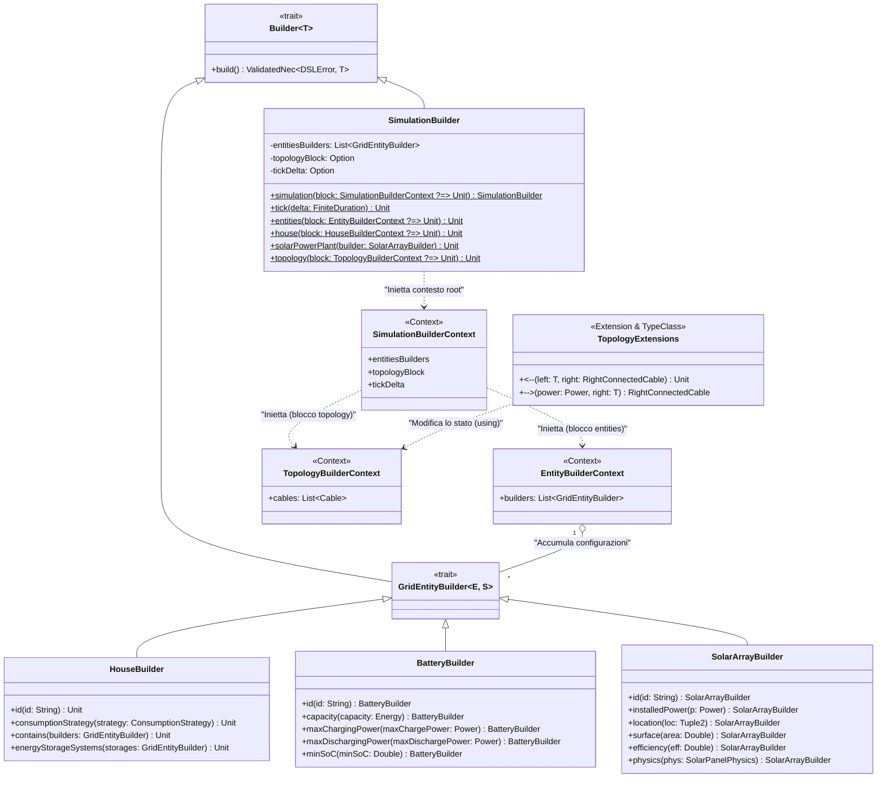

# Matteo Bambini

## DSL (Domain Specific Language)

Il modulo DSL fornisce un layer sintattico dichiarativo per configurare e istanziare l'intera simulazione (modelli fisici e stato iniziale), astraendo e nascondendo la complessità di assemblaggio e di validazione formale delle entità.

---

### 1. Guida all'Utilizzo

La creazione di uno scenario di simulazione è racchiusa nel blocco principale `simulation { ... }`. Al suo interno è possibile configurare la durata temporale del singolo tick, definire in dettaglio le entità della rete e, infine, tracciare la topologia dei collegamenti.

#### Blocco `simulation` e `tick`
Il blocco root racchiude l'intera configurazione dello scenario:
```scala
simulation {
  tick(15.minutes) // Specifica la durata temporale simulata da ogni passo
  entities { ... }
  topology { ... }
}
```

#### Blocco `entities`
Permette di dichiarare e configurare gli elementi da connettere alla micro-grid (case, impianti solari standalone, ecc.). 
> [!NOTE]
> In tutti i blocchi costruttivi del DSL (case, batterie, pannelli solari, ecc.), l'assegnazione dell'identificativo tramite `id("...")` o `id "..."` è **opzionale**. Se non viene esplicitamente specificato, il sistema genererà e assegnerà in automatico un UUID casuale all'entità.

**House**
La configurazione di una casa richiede l'assegnazione di una strategia di consumo (profilo). Opzionalmente, può contenere componenti interni come pannelli solari (`contains`) e batterie (`energyStorageSystems`):
```scala
house:
  id("advanced-house-2")
  consumptionStrategy(traditionalProfile)
  contains(
    solarArray id "pv-1" installedPower 6.kw location (44.50, 11.34) surface 32.0 efficiency 0.20
  )
  energyStorageSystems(
    battery id "batt-1" capacity 16.kwh maxChargingPower 4.kw maxDischargingPower 4.kw minSoC 0.15
  )
```

**Pannelli Solari Standalone**
È possibile dichiarare generatori connessi direttamente alla rete senza un'abitazione ospite:
```scala
solarPowerPlant(
  solarArray id "solar-farm-1" installedPower 100.kw location (44.53, 11.37) surface 500.0 efficiency 0.22
)
```

#### Blocco `topology`
Definisce come le entità precedentemente dichiarate sono interconnesse tramite i cavi e qual è la loro portata massima. Utilizza una sintassi a frecce intuitiva `nodoA <-- potenza --> nodoB`:
```scala
topology {
  EG <-- 25.kw --> E(0) // Collega la rete esterna (External Grid) alla prima entità
  E(0) <-- 12.kw --> E(1) // Collega la prima entità alla seconda
}
```

---

### 2. Dettagli Implementativi

L'implementazione del DSL si basa pesantemente su funzionalità avanzate di Scala 3 per favorire type-safety e fluidità di scrittura: in particolar modo le **Context Functions** (funzioni con parametri di contesto `?=>`), gli **Extension Methods**, e la libreria funzionale **Cats** per l'accumulo degli errori in fase costruttiva.

#### Context Functions (Il Pattern Contextual Builder)
I blocchi nidificati come `simulation { ... }`, `entities { ... }` e `house: ...` sono implementati sfruttando le context functions di Scala 3.
Ogni metodo che apre un blocco accetta una funzione del tipo `Context ?=> Unit`. Ad esempio:
```scala
infix def simulation(block: SimulationBuilderContext ?=> Unit): SimulationBuilder
```
Quando l'utente apre le parentesi graffe o usa la sintassi basata su indentazione (`house:`), il compilatore inietta implicitamente nel body una nuova istanza mutabile del contesto (es. `SimulationBuilderContext`). 
I metodi chiamati all'interno (es. `tick(...)`) estraggono questo contesto dai parametri impliciti mutandone lo stato, evitando la sintassi pesante del classico builder pattern che costringe a concatenare `.withX(...)` in ogni riga.

#### Infix Extensions (Configurazione fluida)
Per la configurazione "inline" su singola riga di batterie e pannelli (es. `battery id "x" capacity 10.kwh`), il DSL utilizza estensioni definite con la keyword `infix`:
```scala
extension (b: BatteryBuilder)
  infix def id(id: String): BatteryBuilder = b.copy(id = Some(id))
  infix def capacity(capacity: Energy): BatteryBuilder = b.copy(maxCapacity = Some(capacity))
```
Questo consente di concatenare i parametri ignorando il punto e le parentesi e simulando una frase in linguaggio naturale. A differenza dei Context Builder, ogni extension method restituisce una nuova copia immutabile del builder parziale.

#### Validazione Sicura e Accumulativa (Cats ValidatedNec)
Tutti i builder del DSL estendono il trait generico `Builder[T]` e specializzato `GridEntityBuilder`, i quali non emettono direttamente gli oggetti finali ma incapsulano la costruzione nel metodo `build()`:
```scala
override def build(): ValidatedNec[DSLError, (Battery, BatteryState)]
```
Impiegando il monade/funtore applicativo `ValidatedNec` di Cats e i relativi combinatori (`.mapN`, `.tupled`), i parametri configurati dal DSL vengono controllati simultaneamente. Anziché fallire in maniera imperativa (lanciando un'eccezione alla prima svista, o *fail-fast*), il `ValidatedNec` permette di validare tutti i campi e **accumulare tutti gli errori sintattici in una lista**, restituendoli in una singola segnalazione per agevolare l'utente.

#### Sintassi Topologica e Type Classes
La dichiarazione a forma di freccia bidirezionale dei collegamenti fisici è un "trucco" sintattico basato su classi intermedie e type class.
L'operatore `-->` combina la potenza (estesa dal DSL come `Power`) e il nodo destro di arrivo in una data-class temporanea `RightConnectedCable`. In coda, l'operatore sinistro `<--` combina il nodo sorgente e l'oggetto intermedio generando definitivamente la connessione via cavo:
```scala
case class RightConnectedCable(maxCapacity: Power, rightEntity: String)

extension (p: Power)
  infix def -->(rightEntity: String): RightConnectedCable =
    RightConnectedCable(p, rightEntity)

  infix def -->(rightEntity: GridEntity): RightConnectedCable =
    RightConnectedCable(p, rightEntity.id)

extension [T: Connectable](left: T)
  infix def <--(rightCable: RightConnectedCable)(using ctx: TopologyBuilderContext): Unit = { ... }
```
Il context bound `[T: Connectable]` è una **Type Class** che astrae la logica di estrazione dell'identificativo del nodo. Permette infatti all'operando `left` di essere non solo un generico oggetto `GridEntity`, ma anche una stringa che rappresenta l'id di una `GridEntity`.

---

### 3. Struttura delle Classi (Builder)

Di seguito un diagramma delle classi che sintetizza la gerarchia dei costruttori DSL. I *Contexts* agiscono da serbatoio di stato locale (per il side-effect delle closure di Scala), mentre i *Builder* validano e compongono gli stati:



---

## Power Flow Solver

Il modulo `org.gridsim.core.solver` è responsabile della risoluzione dei flussi energetici sui cavi della micro-grid in base allo stato delle singole entità (nodi) e alla topologia della rete. L'astrazione principale è rappresentata dal trait `PowerFlowSolver`.

### Il Trait `PowerFlowSolver`
Il trait definisce l'interfaccia funzionale per tutti i solutori:
```scala
trait PowerFlowSolver:
  def solve(entityFlowMap: Map[String, Flow[Energy]]): Map[Cable, Energy]
```
Ricevendo in input la mappa dei flussi netti (surplus o deficit) per ogni nodo della rete, il solutore restituisce il carico assoluto (`Energy` sempre non negativa) che attraversa ogni singolo `Cable`.

Per favorire il polimorfismo, sono fornite due diverse strategie implementative, scambiabili a seconda della tipologia del grafo (ad albero o magliato).

### 1. `SimplePowerFlowSolver` (Topologie Radiali / Ad Albero)
Ideale per reti prive di cicli, questo solutore tratta il `GridGraph` come un albero radicato nel nodo `ExternalGrid`.
Sfruttando un algoritmo basato su una visita post-order (DFS), l'energia viene aggregata partendo dalle foglie verso la radice.
- **Costruzione dell'Albero**: Attraverso una BFS a partire dall'`ExternalGrid`, viene istanziata una struttura dati `Tree` (una mappa dei nodi figli e dei padri).
- **Risoluzione (Subtree Flows)**: Ogni nodo calcola il flusso netto dell'intero suo sotto-albero ricorsivamente.
- **Distribuzione sui Cavi**: Il flusso assoluto che attraversa il cavo tra un nodo A (padre) e un nodo B (figlio) corrisponde esattamente al valore assoluto del flusso netto del sotto-albero di B. L'`ExternalGrid` si fa carico di bilanciare il surplus o deficit residuo senza immettere un proprio flusso.

### 2. `KirchhoffPowerFlowSolver` (Topologie Magliate / Arbitrarie)
Un solutore più universale in grado di gestire correttamente reti contenenti cicli, implementato basandosi su un modello lineare di power flow in corrente continua (DC power flow).
L'algoritmo distribuisce l'energia proporzionalmente sui percorsi paralleli utilizzando un'eliminazione di Gauss con partial pivoting:
- **Matrice Laplaciana**: Costruisce la matrice di ammettenza basandosi unicamente sulla topologia del grafo (poiché in questa astrazione tutti i cavi sono ideali e hanno la medesima suscettanza pari a 1).
- **Nodo di Riferimento**: Imposta l'`ExternalGrid` come *reference bus* (ponendo il suo angolo di fase $\theta = 0$).
- **Risoluzione del Sistema Lineare**: Il sistema ridotto $B \cdot \theta = P$ (dove $B$ è la matrice laplaciana priva della riga/colonna di riferimento e $P$ è il vettore delle iniezioni di potenza nette) viene risolto calcolando le "fasi" $\theta$ per ogni nodo.
- **Distribuzione sui Cavi**: Il flusso di energia che attraversa un cavo unente i nodi $i$ e $j$ viene infine ricavato calcolando la differenza di fase in valore assoluto $|\theta_i - \theta_j|$.

Nel caso venga applicato su reti ad albero, il `KirchhoffPowerFlowSolver` restituisce algebreamente i medesimi risultati esatti del `SimplePowerFlowSolver`.

---

## Visualizzazione del Grafo (GUI)

L'interfaccia utente impiega la libreria open-source **JavaFXSmartGraph** per tracciare la topologia della rete, fornendo un feedback visivo istantaneo sui flussi energetici e lo stato fisico dell'infrastruttura. L'integrazione è architettata seguendo rigorosamente il pattern **MVVM** (Model-View-ViewModel), separando la logica di preparazione e trasformazione dei dati dalla renderizzazione JavaFX nei file `GridGraphViewModel` e `GridGraphView`.

### `GridGraphViewModel` (Adattatore Logico)
Il ViewModel funge da adattatore tra il `GridGraph` puro del dominio e la sua rappresentazione UI, conservando lo stato di flussi ed eventuali sovraccarichi.
- **Implicit Conversion (Scala 3)**: Per tradurre il modello concettuale nel modello nativo della libreria visuale (`Graph[String, String]`), il file definisce una *given Conversion* di Scala 3:
```scala
given Conversion[GridGraph, Graph[String, String]] with
  override def apply(gridGraph: GridGraph): Graph[String, String] = { ... }
```
In questo modo, il dominio viene trasformato in maniera trasparente in una `GraphEdgeList` istanziata dalla libreria. I vertici del grafo visivo diventano gli `id` alfanumerici, mentre gli archi vengono mappati deduplicando i cavi paralleli in modo da garantire leggibilità UI.
- **Reactive Update**: Espone un *hook* (`onUpdate()`) invocato dal dispatcher dell'applicazione quando arriva un nuovo `SimulationSnapshot`. Memorizza il nuovo stato computato (`entityFlows` e `cableLoads`) per i tick successivi.
- **Events & Interactivity**: Incapsula la logica di selezione utente propagando il target selezionato (nodo o cavo) al resto dell'applicazione tramite un `ObjectProperty[Selection]`.

### `GridGraphView` (Render ScalaFX)
Il componente si occupa unicamente della renderizzazione e manipolazione del Document Object Model dell'interfaccia, incapsulando il componente nativo Java all'interno di un `BorderPane` di ScalaFX.
- **SmartGraphPanel**: Componente *core* delegato al disegno grafico. Durante la sequenza di boot (dopo il rendering della *scene*), la fisica dinamica della libreria viene disabilitata (`setAutomaticLayout(false)`) assicurando che le coordinate dei nodi rimangano fisse e predicibili all'utente.
- **Custom Styling & Bindings**: Il nodo radice `ExternalGrid` (EG) richiede particolari customizzazioni. Per associarvi un'etichetta testuale persistente, le coordinate della label testuale sono saldate in tempo reale a quelle del vertice grafico attraverso i *JavaFX Bindings* (`Bindings.createDoubleBinding`), evitando desincronizzazioni in caso di interazione drag-and-drop.
- **Feedback Cromatico Dinamico**: Al momento del trigger `onUpdate` asincrono (eseguito rigorosamente sul thread grafico con `Platform.runLater`), la View esamina lo stato aggiornato dal ViewModel per sovrascrivere dinamicamente le classi CSS (`setStyleInline`) degli elementi visuali:
  - **Entità (Nodi)**: Contorno marcato in rosso acceso `#e74c3c` in caso di `Deficit` energetico, altrimenti verde `#2ecc71`.
  - **Cavi (Archi)**: Modificati dinamicamente in rosso se si verifica un sovraccarico fisico (potenza transitante superiore alla `maxCapacity` limite nel delta di tempo), altrimenti ricolorati di nero.

---

## Observability

Il package `org.gridsim.core.observability` definisce l'astrazione per l'esportazione dei dati di simulazione, progettata per disaccoppiare totalmente il motore puramente funzionale dai consumatori finali (come la GUI o il motore delle statistiche). L'architettura del modulo è volutamente agnostica rispetto al meccanismo di trasporto sottostante: i consumatori possono ricevere i dati tramite canali locali, broker di messaggi o stream reattivi, garantendo l'espandibilità del sistema in ottica futura, come ad esempio rendere la simulazione distribuibile su più sistemi.

### 1. `SimulationData` e la Type Class `Sliceable`
Per evitare che i consumatori ricevano necessariamente l'intero stato globale della simulazione, i dati in uscita sono modellati tramite un Algebraic Data Type (ADT) `enum SimulationData`. Questo tipo espone diverse proiezioni (o "slice") dello stato (ad esempio `EnvironmentData`, `EntityFlowsData`, `CableLoadsData` o un aggregato completo `SimulationSnapshot`).
L'estrazione del dato dal mega-stato `SimulationState` non avviene tramite conversioni hard-coded, bensì in modo polimorfico grazie alla type class `Sliceable[A]`. Questa feature estensibile di Scala 3 permette di definire, tramite `given sliceableSimulationState`, come "tagliare" dinamicamente un determinato frammento dello stato in base al tipo richiesto (riconosciuto a runtime tramite una `ClassTag`).

### 2. Sottoscrizione tipizzata con `Observer`
Gli observer (i consumatori dei dati) sono definiti mediante la case class `Observer[F[_]]`, dove `F` rappresenta l'involucro degli effetti (il tipo monadico). L'iscrizione avviene sfruttando uno *smart constructor* che accetta come unico parametro la callback. Ricorrendo implicitamente alle `ClassTag`, il costruttore inferisce automaticamente quale tipologia di `SimulationData` interessa al consumatore ed esegue i cast a runtime in modo protetto, esponendo verso l'esterno un'API elegante e rigorosamente type-safe:
```scala
def apply[F[_], T <: SimulationData](
    onUpdate: T => F[Unit]
)(using tag: scala.reflect.ClassTag[T]): Observer[F] =
  Observer(
    tag.runtimeClass.asInstanceOf[Class[_ <: SimulationData]],
    data => onUpdate(data.asInstanceOf[T])
  )
```
Grazie a questa inferenza, istanziare un consumatore (ad esempio, per osservare unicamente i cambiamenti dell'ambiente tramite l'effetto `IO`) risulta estremamente pulito dal lato client:
```scala
val obs = Observer[IO, SimulationData.EnvironmentData] { data => IO.println(data.environment) }
```

### 3. Astrazione di Dispatching (`DataDispatcher`)
L'interfaccia centrale per l'esportazione dei dati è rappresentata dal trait `DataDispatcher[F[_]]`. Esso definisce un singolo metodo `dispatch` incaricato di ricevere e distribuire l'intero stato della simulazione e il delta temporale a tutti gli observer registrati:
```scala
trait DataDispatcher[F[_]]:
  def dispatch(state: SimulationState, delta: FiniteDuration): F[Unit]
```
La semplicità di questa interfaccia garantisce che il core della simulazione non debba preoccuparsi di *come* i dati verranno smistati, lasciando totale libertà all'implementazione concreta.

#### 3.1. Dettaglio Implementativo: Publish-Subscribe con `Fs2DataDispatcher`
L'attuale implementazione concreta del `DataDispatcher` si basa sul pattern Publish-Subscribe sfruttando nativamente la libreria di streaming funzionale **FS2** (`fs2.concurrent.Topic`). Essendo un puro dettaglio implementativo, tale meccanismo non intacca le astrazioni descritte sopra.
Al momento dell'inizializzazione, lo smart constructor del dispatcher:
1. Crea un `Topic` FS2 indipendente per ogni tipo di evento/dato definito in `SimulationData`.
2. Iscrive ciascun `Observer` al proprio topic di interesse, registrando una sottoscrizione (`subscribe`) e avviando un Fiber asincrono in background (`.start`) per l'ascolto concorrente.
3. Ad ogni tick, quando il motore termina l'aggiornamento e restituisce il nuovo stato, il metodo `dispatch` estrae i frammenti (`slice`) e li pubblica simultaneamente (tramite `publish1`) ai rispettivi topic, smaltendo l'aggiornamento in modo non bloccante.
