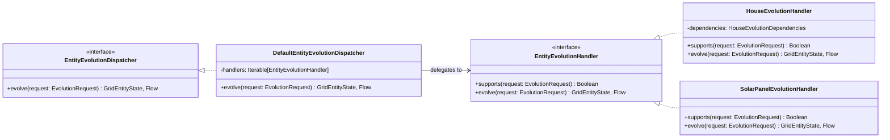

# Relazione sull'Implementazione - Michele Nardini

Il presente capitolo descrive in dettaglio le scelte strategiche, i pattern funzionali e le componenti chiave del
codice Scala sviluppato da me, Enrico Marchionni.
L'esposizione è supportata da frammenti di codice esplicativi.

---

## 1. Quadro Generale dei Contributi Sviluppati

Nel contesto del progetto **GridSim**, Michele Nardini ha progettato e sviluppato i seguenti moduli logici:

* **Modellazione del Dominio e Unità di Misura (Core Models)**:
  * Definizione delle entità fisiche e dei loro stati dinamici: [House](file:///home/michelenardini/GridSim/app/src/main/scala/org/gridsim/core/model/house/House.scala), [HouseState](file:///home/michelenardini/GridSim/app/src/main/scala/org/gridsim/core/model/house/HouseState.scala), [Battery](file:///home/michelenardini/GridSim/app/src/main/scala/org/gridsim/core/model/storage/battery/Battery.scala) e [BatteryState](file:///home/michelenardini/GridSim/app/src/main/scala/org/gridsim/core/model/storage/battery/BatteryState.scala).
  * Modellazione algebrica delle grandezze fisiche a costo zero tramite opaque types: [Power](file:///home/michelenardini/GridSim/app/src/main/scala/org/gridsim/core/common/Power.scala) ed [Energy](file:///home/michelenardini/GridSim/app/src/main/scala/org/gridsim/core/common/Energy.scala).
  * Rappresentazione algebrica dei flussi bidirezionali: [Flow](file:///home/michelenardini/GridSim/app/src/main/scala/org/gridsim/core/common/Flow.scala).
* **Motore di Simulazione e Concorrenza (Simulator Engine & Controller)**:
  * Ciclo di evoluzione discreto basato su pipeline monadiche pure: [DefaultSimulationEngine](file:///home/michelenardini/GridSim/app/src/main/scala/org/gridsim/core/simulation/DefaultSimulationEngine.scala).
  * Esecuzione periodica concorrente, thread-safe e configurabile in tempo reale: [DefaultSimulationController](file:///home/michelenardini/GridSim/app/src/main/scala/org/gridsim/core/simulation/DefaultSimulationController.scala).
* **Evoluzione Temporale e Dispatching Polimorfo (Grid Evolution & Dispatching)**:
  * Architettura basata su registri ed estendibile per l'avanzamento dei nodi: [EntityEvolutionDispatcher](file:///home/michelenardini/GridSim/app/src/main/scala/org/gridsim/core/behaviour/EntityEvolutionDispatcher.scala), [EntityEvolutionHandler](file:///home/michelenardini/GridSim/app/src/main/scala/org/gridsim/core/behaviour/EntityEvolutionHandler.scala).
  * Gestione del bilancio energetico domestico sequenziale in due fasi: [HouseEvolution](file:///home/michelenardini/GridSim/app/src/main/scala/org/gridsim/core/behaviour/house/HouseEvolution.scala).
  * Strategie reattive di carica/scarica delle batterie: [StorageEnergyExchanger](file:///home/michelenardini/GridSim/app/src/main/scala/org/gridsim/core/behaviour/storage/StorageEnergyExchanger.scala), [BatteryEnergyExchange](file:///home/michelenardini/GridSim/app/src/main/scala/org/gridsim/core/behaviour/storage/battery/BatteryEnergyExchange.scala).
* **Infrastruttura di Validazione Semantica (Validator)**:
  * Progettazione dell'algebra di validazione e accumulazione non degli errori: [Validator](file:///home/michelenardini/GridSim/app/src/main/scala/org/gridsim/core/validation/Validator.scala).
  * Validatori specifici e di coerenza topologica globale: [BatteryValidator](file:///home/michelenardini/GridSim/app/src/main/scala/org/gridsim/core/validation/BatteryValidator.scala), [HouseValidator](file:///home/michelenardini/GridSim/app/src/main/scala/org/gridsim/core/validation/HouseValidator.scala) e [SimulationValidator](file:///home/michelenardini/GridSim/app/src/main/scala/org/gridsim/core/validation/SimulationValidator.scala).
* **Interfaccia Grafica e Presentazione (GUI - MVVM & Ports)**:
  * Architettura Model-View-ViewModel (MVVM) con bindings reattivi: [ScenarioSelectionView](file:///home/michelenardini/GridSim/app/src/main/scala/org/gridsim/gui/view/ScenarioSelectionView.scala) e [ScenarioSelectionViewModel](file:///home/michelenardini/GridSim/app/src/main/scala/org/gridsim/gui/viewmodel/ScenarioSelectionViewModel.scala).
  * Visualizzazione dettagli delle entità: [EntityDetailsView](file:///home/michelenardini/GridSim/app/src/main/scala/org/gridsim/gui/view/EntityDetailsView.scala)

---

## 2. Modellazione delle Unità di Misura e Flussi (Opaque Types & ADT)

La simulazione numerica di un dominio fisico richiede una rigorosa modellazione dei vincoli dimensionali per prevenire errori semantici (es. sommare grandezze non omogenee). A tal fine, si è fatto ricorso alle potenzialità del type system di Scala 3, implementando **Opaque Types** e **Algebraic Data Types (ADT)**.

### 2.1 Astrazione a Costo Zero (Opaque Types)
Per modellare le grandezze fisiche di potenza (kW) ed energia (kWh) prevenendo accoppiamenti errati a tempo di compilazione, sono stati definiti i tipi opachi `Power` ed `Energy`:

```scala
// In org.gridsim.core.common.Power
opaque type Power = Double

object Power:
  def apply(v: Double): Power = v
  
  extension (p: Power)
    def toDouble: Double = p
    @targetName("powerPlus") def +(o: Power): Power = p + o
    // ... altri operatori algebrici

// In org.gridsim.core.common.Energy
opaque type Energy = Double

object Energy:
  def apply(v: Double): Energy = v
```
* **Vantaggi principali**:
  * **Type Safety a tempo di compilazione**: Il compilatore tratta `Power` ed `Energy` come tipi disgiunti. Qualsiasi tentativo di sommare potenza ed energia o di passare un valore di potenza dove è atteso un valore di energia genera un errore di compilazione statico.

### 2.2 Rappresentazione Semantica dei Flussi (Flow ADT)
Lo scambio bidirezionale di energia nella micro-grid (surplus, deficit o bilanciamento) è modellato come un tipo algebrico di dati somma (ADT) tramite un `enum` parametrizzato:

```scala
enum Flow[+A]:
  case Surplus(amount: A)
  case Deficit(amount: A)
  case Balanced
```
Il coordinamento tra la grandezza fisica `Energy` e la semantica del flusso è gestito mediante estensioni che implementano regole algebriche interne:

```scala
// Conversione da Energy a Flow[Energy]
def toFlow: Flow[Energy] =
  if e > 0.0 then Flow.Surplus(e)
  else if e < 0.0 then Flow.Deficit(e.abs)
  else Flow.Balanced

// Somma algebrica tra flussi
extension (f: Flow[Energy])
  def value: Double = f match
    case Flow.Surplus(e) => e.toDouble
    case Flow.Deficit(e) => -e.toDouble
    case Flow.Balanced   => 0.0

  def +(o: Flow[Energy]): Flow[Energy] =
    (f.value + o.value).kwh.toFlow
```

---

## 3. Gestione Funzionale dello Stato (State Monad)

La transizione di stato tra i singoli passi discreti della simulazione deve avvenire in modo referenzialmente trasparente e deterministico. Per coordinare questa pipeline senza ricorrere a mutabilità in-place o concatenazioni manuali, in [DefaultSimulationEngine.scala](file:///home/michelenardini/GridSim/app/src/main/scala/org/gridsim/core/simulation/DefaultSimulationEngine.scala) è stata adottata la monade **State** (`cats.data.State`).

### 3.1 Sequenziamento del Tick Simulativo
Il ciclo di evoluzione temporale ad ogni passo (tick) è strutturato come una *for-comprehension* che compone sequenzialmente le transizioni di stato:

```scala
override def step(state: SimulationState, delta: FiniteDuration): SimulationState =
  simulationPipeline(delta).run(state).value._1

private def simulationPipeline(delta: FiniteDuration): State[SimulationState, Unit] =
  for {
    _ <- advanceEnvironment(delta)
    _ <- evolveEntities(delta)
    _ <- calculateCableLoads
  } yield()
```
* **Funzionamento**:
  - `step` accetta uno snapshot immutabile `SimulationState` e avvia la computazione monadica mediante `.run(state)`. Il valore ritornato corrisponde al nuovo stato immutabile consolidato.
  - La *for-comprehension* incapsula tre transizioni di stato distinte:
    1. **`advanceEnvironment`**: Incrementa il contatore temporale e aggiorna le condizioni meteorologiche.
    2. **`evolveEntities`**: Calcola l'evoluzione interna di ciascun nodo ricavando i flussi residui.
    3. **`calculateCableLoads`**: Esegue l'algoritmo di risoluzione dei flussi elettrici sui cavi di collegamento.

Ogni fase aggiorna lo stato globale in modo sicuro mediante la primitiva `State.modify`.

---

## 4. Infrastruttura di Validazione Semantica (Accumulo degli Errori)

La corretta inizializzazione del sistema richiede la validazione dei vincoli fisici e topologici delle componenti. Per massimizzare la diagnostica e prevenire l'interruzione al primo errore riscontrato è stata implementata un'infrastruttura di validazione basata su funtori applicativi e sul tipo `ValidatedNec` di **Cats**.

### 4.1 La Type Class `Validator` e la Composizione Applicativa
L'astrazione di validazione è definita tramite la type class `Validator` in [Validator.scala](file:///home/michelenardini/GridSim/app/src/main/scala/org/gridsim/core/validation/Validator.scala):

```scala
trait Validator[E]:
  def validate(a: E): ValidatedNec[DomainError, E]
```
Utilizzando `ValidatedNec` (dove `Nec` rappresenta una `NonEmptyChain`), le violazioni non interrompono il flusso, ma vengono accumulate in una struttura dati non vuota. Le estensioni su tipi numerici consentono di definire regole formali atomiche e riutilizzabili (es. `mustBePositive`, `mustBeInRange`).

### 4.2 Validazione della Batteria (BatteryValidator)
Il validatore della batteria verifica contemporaneamente i parametri statici dell'entità e la coerenza dello stato di carica dinamico:

```scala
given Validator[(Battery, BatteryState)] with
  def validate(pair: (Battery, BatteryState)): ValidatedNec[DomainError, (Battery, BatteryState)] =
    val (entity, state) = pair
    (
      validateCoherence(entity, state),
      validateBatteryEntity(entity),
      validateBatteryState(entity, state)
    ).mapN((_, _, _) => pair)
```

### 4.3 Validazione di Coerenza Globale (SimulationValidator)
Durante l'assemblaggio di componenti validi all'interno di una simulazione eseguibile, sorgono vincoli di coerenza globali tra la topologia statica e lo stato dinamico iniziale. Questi requisiti sono formalizzati in [SimulationValidator.scala](file:///home/michelenardini/GridSim/app/src/main/scala/org/gridsim/core/validation/SimulationValidator.scala):

```scala
private def validateStateAndModelCoherence(state: SimulationState, model: SimulationModel): ValidatedNec[DomainError, Unit] =
  val nodeIds = model.grid.nodes.map(_.id).toSet
  val cables = model.grid.cables.toSet
  (
    validateEntityStatesMatchModelEntity(state, nodeIds),
    validateEntityFlows(state, nodeIds),
    validateCableLoads(state, cables)
  ).mapN((_, _, _) => ())
```
Il validatore garantisce l'allineamento degli ID e delle connessioni, accumulando tutti gli errori in caso di scenario mal configurato.

---

## 5. Evoluzione Temporale e Dispatching Polimorfo (Dispatcher & Handlers)

Al fine di garantire l'estendibilità del simulatore secondo l'**Open-Closed Principle**, il motore di simulazione è stato completamente disaccoppiato dalle famiglie concrete di entità. L'evoluzione di ciascun nodo della micro-grid è gestita da un'architettura basata sul *Registry Pattern* implementata in [EntityEvolutionDispatcher.scala](file:///home/michelenardini/GridSim/app/src/main/scala/org/gridsim/core/behaviour/EntityEvolutionDispatcher.scala) ed [EntityEvolutionHandler.scala](file:///home/michelenardini/GridSim/app/src/main/scala/org/gridsim/core/behaviour/EntityEvolutionHandler.scala).



### 5.1 Astrazione del Tick Evolutivo (`EvolutionRequest`)
Ogni singola computazione evolutiva è incapsulata in una struttura dati immutabile denominata `EvolutionRequest`:
```scala
final case class EvolutionRequest(
  entity: GridEntity,
  state: GridEntityState,
  env: Environment,
  delta: FiniteDuration
)
```

### 5.2 Il Registro di Dispatching (`EntityEvolutionDispatcher`)
L'interfaccia `EntityEvolutionDispatcher` espone una singola operazione di evoluzione. La sua implementazione di default (`DefaultEntityEvolutionDispatcher`) delega l'operazione a una collezione di handler registrati:

```scala
override def evolve(
  request: EvolutionRequest
): (GridEntityState, Flow[Energy]) =
  handlers.filter(_.supports(request)) match
    case handler :: Nil =>
      val (newState, flow) = handler.evolve(request)
      newState -> flow
    case Nil =>
      throw IllegalArgumentException(
        s"No evolution handler supports state " +
          s"'${request.state.getClass.getSimpleName}' and entity " +
          s"'${request.entity.getClass.getSimpleName}'"
      )
```
* **Estendibilità**: Ciascun `EntityEvolutionHandler` dichiara se è in grado di processare una richiesta tramite il predicato `supports(request)`. Ciò permette di integrare nuove entità semplicemente registrando un nuovo handler, senza modificare il nucleo del ciclo di simulazione.

---

## 6. Evoluzione Temporale e Reattività dei Nodi

### 6.1 Risoluzione del Bilancio Energetico Domestico (HouseEvolution)
Il comportamento di evoluzione dell'abitazione in [HouseEvolution.scala](file:///home/michelenardini/GridSim/app/src/main/scala/org/gridsim/core/behaviour/house/HouseEvolution.scala) coordina la logica di consumo e l'interazione con i dispositivi ad essa collegati:

```scala
object HouseEvolution extends GridEvolution[HouseState, House, EvolutionContext[HouseEvolutionDependencies]]:
  extension (state: HouseState)
    def evolve(house: House, environment: Environment)(
      using context: EvolutionContext[HouseEvolutionDependencies]
    ): (HouseState, Flow[Energy]) =
      val initialFlow = resolveConsumption(house, environment)
      val componentsById = house.components.map(c => c.id -> c).toMap

      val result =
        HouseComponentEvolution.evolveAll(
          states = state.componentStates,
          componentsById = componentsById,
          initialFlow = initialFlow,
          environment = environment
        )(using context.delta)

      (state.copy(componentStates = result.states), result.flow)
```
Il bilancio elettrico domestico segue una rigida precedenza fisica calcolata sequenzialmente tramite `evolveAll` (prima i generatori solari per soddisfare il fabbisogno locale, e successivamente gli accumulatori).

### 6.2 Reattività dei Sistemi di Accumulo (StorageEnergyExchanger)
I sistemi di accumulo non possiedono un'evoluzione temporale autonoma, ma operano in modo **reattivo** rispetto a flussi preesistenti nella rete. Per formalizzare questa distinzione semantica è stata introdotta la type class [StorageEnergyExchanger](file:///home/michelenardini/GridSim/app/src/main/scala/org/gridsim/core/behaviour/storage/StorageEnergyExchanger.scala):

```scala
trait StorageEnergyExchanger[S <: StorageState, E <: Storage]:
  def exchange(
    state: S,
    entity: E,
    flow: Flow[Energy],
    env: Environment
  )(using delta: FiniteDuration): (S, Flow[Energy])
```
L'adattatore concreto per le batterie ([BatteryEnergyExchange.scala](file:///home/michelenardini/GridSim/app/src/main/scala/org/gridsim/core/behaviour/storage/battery/BatteryEnergyExchange.scala)) implementa questa type class eseguendo il dispatching in base al tipo di flusso energetico rilevato (`Surplus` -> carica, `Deficit` -> scarica).

---

## 7. Architettura GUI ed Infrastruttura di Presentazione (MVVM & Ports)

Per l'interfaccia utente grafica è stata progettata un'architettura robusta e disaccoppiata basata sul pattern **Model-View-ViewModel (MVVM)**, integrando un meccanismo di binding reattivo e porte di astrazione per l'estrazione dati e il controllo del ciclo di vita.

### 7.1 Pattern MVVM e Data Binding (ScalaFX)
La GUI separa nettamente la dichiarazione degli elementi visivi (la View) dalla logica e dallo stato della presentazione (il ViewModel). Le componenti interagiscono per mezzo del data binding reattivo nativo di ScalaFX.

Ad esempio, in [ScenarioSelectionView.scala](file:///home/michelenardini/GridSim/app/src/main/scala/org/gridsim/gui/view/ScenarioSelectionView.scala) e [ScenarioSelectionViewModel.scala](file:///home/michelenardini/GridSim/app/src/main/scala/org/gridsim/gui/viewmodel/ScenarioSelectionViewModel.scala), i campi di configurazione temporale e di stato sono legati in modo bidirezionale (`<==>`) o monodirezionale (`<==`):

```scala
// Nella View (ScenarioSelectionView)
private val tickAmountField = new TextField:
  text <==> viewModel.tickAmountText

private val startButton = new Button("Start"):
  disable <== viewModel.isStartDisabled
  onAction = _ => viewModel.startScenario().foreach(onScenarioLoaded)
```

```scala
// Nel ViewModel (ScenarioSelectionViewModel)
val tickAmountText = StringProperty("15")
val isStartDisabled = BooleanProperty(scenarios.isEmpty)
```
Questo approccio garantisce che la View rimanga una componente puramente dichiarativa e facilmente sostituibile o testabile, mentre la logica di validazione e di trasformazione dell'input dell'utente rimanga confinata all'interno del ViewModel.

### 7.2 Estrazione e Formattazione dei Dati (`DetailExtractor` & `DetailDispatcher`)
La GUI deve rappresentare le entità del dominio fisico mostrando informazioni dettagliate e aggiornate ad ogni tick. Per evitare l'accoppiamento tra la visualizzazione e il modello interno del simulatore, è stata creata la type class polimorfa `DetailExtractor` in [DetailExtractor.scala](file:///home/michelenardini/GridSim/app/src/main/scala/org/gridsim/gui/ports/DetailExtractor.scala):

```scala
trait DetailExtractor[E <: GridEntity, S <: GridEntityState]:
  def extract(entity: E, state: S, env: Environment): ExtractedEntityDetails
```
Attraverso istanze concrete `given` (es. `DetailExtractor[Battery, BatteryState]`), le specifiche del modello e dello stato vengono estratte in un formato standard `ExtractedEntityDetails` (composto da coppie chiave-valore di stringhe e sub-componenti installate).

Il `DetailDispatcher` centralizza la risoluzione di nodi, cavi e stati attivi tramite pattern matching:
```scala
def resolveEntity(
    entity: GridEntity,
    state: GridEntityState,
    env: Environment
): ExtractedEntityDetails =
  (entity, state) match
    case (b: Battery, s: BatteryState) =>
      summon[DetailExtractor[Battery, BatteryState]].extract(b, s, env)
    case (p: SolarPanel, s: SolarPanelState) =>
      summon[DetailExtractor[SolarPanel, SolarPanelState]].extract(p, s, env)
    case (h: House, s: HouseState) =>
      summon[DetailExtractor[House, HouseState]].extract(h, s, env)
    case _ => ExtractedEntityDetails(Seq(DetailField("Info", "No field available")))
```

---

[Implementazione](06-implementation.md)
