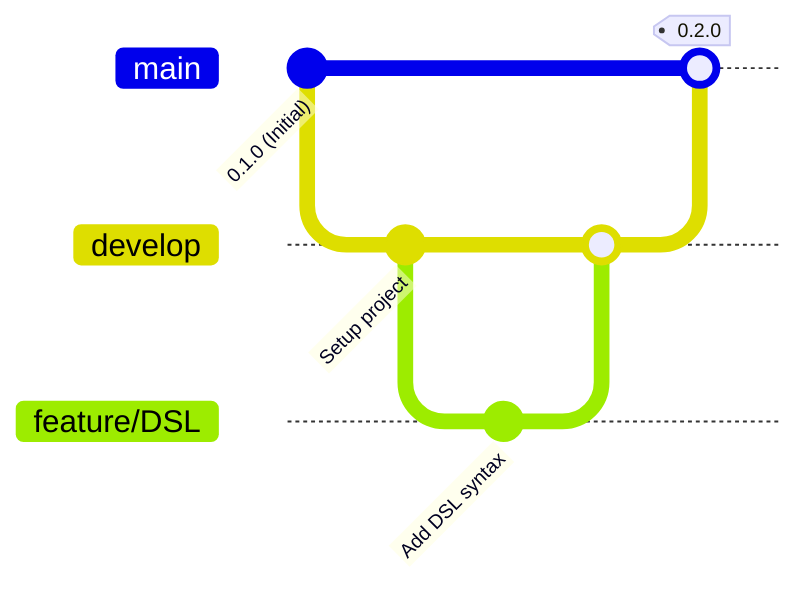

# Linee guida per il flusso di lavoro di Git (GitFlow)

Per garantire una collaborazione strutturata, tracciabile e priva di conflitti durante lo sviluppo di **GridSim**, adotteremo la metodologia **GitFlow**. Questo approccio separa chiaramente il codice in produzione, lo sviluppo in corso e le singole funzionalità.

## I rami principali (branch di lunga durata)

Il repository è strutturato attorno a due rami principali che esistono per tutta la durata del progetto:

- `main`: Contiene esclusivamente codice stabile, testato e pronto per il rilascio (produzione).
  Ogni commit su questo ramo corrisponde a una release ufficiale taggata (es. `1.0.0`).
- `develop`: È il ramo di integrazione principale per lo sviluppo.
  Contiene le ultime funzionalità completate e pronte per il prossimo rilascio.
  Tutti i rami di funzionalità partono da qui e ritornano qui.



## Rami di supporto (branch temporanei)

Vengono aperti per scopi specifici e devono essere eliminati una volta completati e integrati.

### A. Feature Branches (`feature/*`)

- **Scopo:** Sviluppare nuove funzionalità o refactoring specifici.
- **Ramo di partenza:** `develop`
- **Ramo di atterraggio (Merge):** `develop`
- **Convenzione Nomi:** `feature/nome-funzionalita` (es. `feature/simulation-engine`, `feature/gui-plots`)

### B. Release Branches (`release/*`)

- **Scopo:** Preparare una nuova release ufficiale (pulizia finale del codice, correzione di piccoli bug dell&#39;ultimo minuto, aggiornamento della documentazione e delle versioni).
- **Ramo di partenza:** `develop`
- **Rami di atterraggio (Merge):** Sia `main` che `develop`
- **Convenzione Nomi:** `release/X.Y.Z` (es. `release/1.0.0`)

### C. Hotfix Branches (`hotfix/*`)

- **Scopo:** Risolvere bug critici riscontrati direttamente in produzione (`main`) che non possono attendere il normale ciclo di rilascio.
- **Ramo di partenza:** `main`
- **Rami di atterraggio (Merge):** Sia `main` che `develop`
- **Convenzione Nomi:** `hotfix/X.Y.Z` (es. `hotfix/1.0.1`)

## Flussi di lavoro dettagliati

### 🚀 Sviluppare una Nuova Feature

- Assicurati che il tuo ramo `develop` locale sia allineato con il server remoto:

```bash
git checkout develop
git pull origin develop
```

- Crea il ramo della feature:

```bash
git checkout -b feature/nome-feature
```

- Lavora, fai commit e mantieni aggiornata la feature integrando eventuali novità da `develop`:

```bash
git fetch origin
git merge origin/develop
```

- Concludi la feature creando una Pull Request (PR) da `feature/nome-feature` verso `develop`.
  Una volta approvata ed eseguito il merge, elimina il ramo locale e remoto:

```bash
git branch -d feature/nome-feature
```

### 📦 Preparare una Release

- Crea il ramo di release partendo da `develop` (quando `develop` contiene tutte le feature pianificate per la release):

```bash
git checkout develop
git pull origin develop
git checkout -b release/1.0.0
```

- Apporta le correzioni finali e aggiorna i file di configurazione (es. versioni in `build.gradle.kts`).
- Effettua il merge su `main` e applica il tag di versione:


```bash
git checkout main
git pull origin main
git merge --no-ff release/1.0.0
git tag -a 1.0.0 -m "Release 1.0.0"
git push origin main --tags
```

- Riporta le modifiche e le correzioni effettuate nella release anche su `develop`:

```bash
git checkout develop
git merge --no-ff release/1.0.0
git push origin develop
```

- Elimina il ramo di release:

```bash
git branch -d release/1.0.0
```

### 🚨 Risolvere un Bug critico in produzione (Hotfix)

- Crea il ramo di hotfix partendo direttamente da `main`:

```bash
git checkout main
git pull origin main
git checkout -b hotfix/1.0.1
```

- Risolvi il bug e fai il commit.
- Effettua il merge su `main` con il nuovo tag:

```bash
git checkout main
git merge --no-ff hotfix/1.0.1
git tag -a 1.0.1 -m "Hotfix 1.0.1"
git push origin main --tags
```

- Integra la correzione anche su `develop`:

```bash
git checkout develop
git merge --no-ff hotfix/1.0.1
git push origin develop
```

- Elimina il ramo di hotfix:

```bash
git branch -d hotfix/1.0.1
```

[Sommario](../index.md) |
[Regole per messaggi di commit](commit_guidelines.md)
