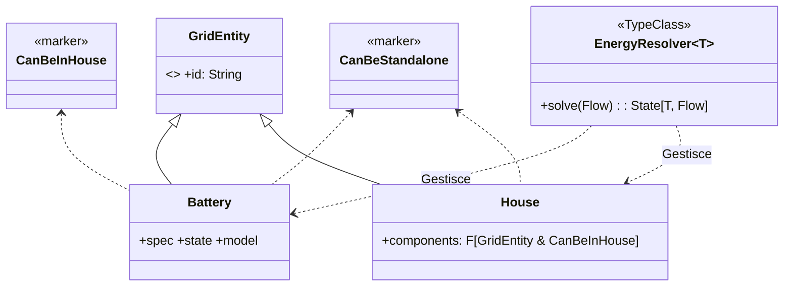

# 📑 Report Tecnico: Evoluzione Architetturale GridSim Core

## 1. Pilastri del Design

### A. Role-Based Modeling (Marker Traits)
Ho definito **Marker Traits** che definiscono le "capacità" delle entità:
- `CanBeInHouse`: Indica che l'entità può essere contenuta in una casa.
- `CanBeStandalone`: Indica che l'entità può esistere autonomamente sulla grid.
- **Intersection Types:** La `House` accetta componenti di tipo `GridEntity & CanBeInHouse`, garantendo strutturalmente che una casa non possa contenere un'altra casa.

### B. Gestione dello Stato (State Monad)
La simulazione fisica è modellata tramite `cats.data.State[S, A]`.
- Ogni trasformazione energetica riceve un flusso, aggiorna lo stato interno dell'entità e restituisce il residuo.
- Il "threading" dello stato è gestito in modo deterministico e senza effetti collaterali.

### C. Pattern Strategy per la Fisica
La logica delle batterie è disaccoppiata tramite il pattern **Strategy**:
- `BatteryModel`: Enum per la scelta della tecnologia.
- `BatteryStrategy`: Interfaccia intercambiabile per gli algoritmi di carica/scarica.
- Questo permette di iniettare logiche di invecchiamento (aging) o efficienza variabile senza toccare il motore di calcolo.

---

## 3. Organizzazione del Modulo `behaviour`
Il codice è stato suddiviso in "Vertical Slices" per facilitare la manutenzione:
- `behaviour/battery/`: Logiche e strategie specifiche per l'accumulo.
- `behaviour/house/`: Profili di consumo e strategie di carico.
- `EnergyResolver.scala`: Orchestratore universale dei flussi energetici.

---

## 4. Diagramma Architetturale (UML)

---

## 5. Linee Guida per lo Sviluppo
1.  **Immutabilità:** Mai usare `var`. Le entità si aggiornano tramite `.copy()`.
2.  **Purezza:** Ogni nuova logica deve restituire un'azione `State`.
3.  **Validazione:** Ogni entità deve essere creata tramite Smart Constructor (`make`) per garantire la validità fisica dei dati.
4.  **Estensione:** Per un nuovo componente, definire il dato in `model`, la logica in `behaviour` e registrarlo nel dispatcher di `EnergyResolver`.

---

**Stato attuale:** Il core è stabile, testato (BatterySpec, HouseSpec) e pronto per l'implementazione di nuove fonti (Solar, Wind) o logiche di mercato.
